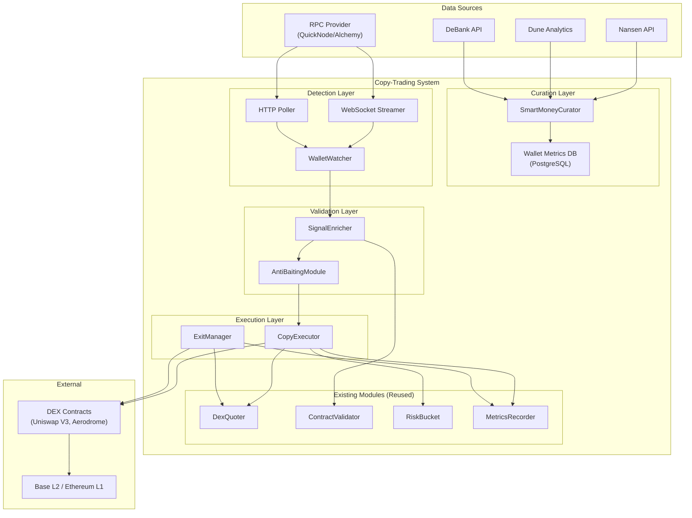
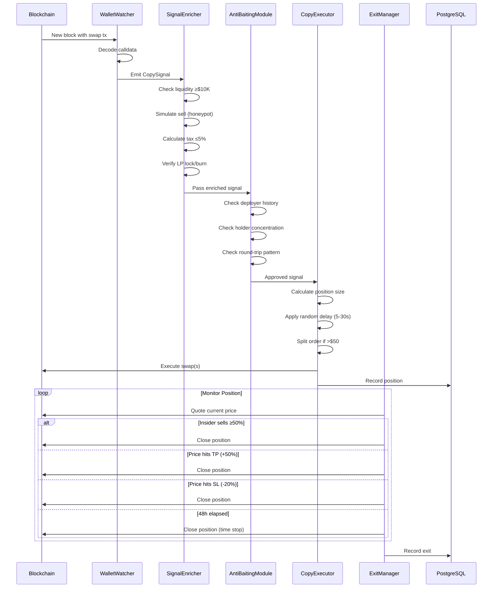
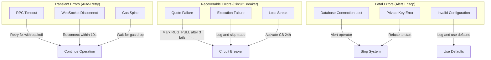

# Technical Design Document: Copy-Trading Smart Money

## Overview

Este documento describe la arquitectura técnica del módulo Copy-Trading Smart Money, un sistema que monitorea wallets "smart money" curadas en tiempo real y replica automáticamente sus trades de manera proporcional.

### Contexto del Pivote Estratégico

El sistema anterior de micro-cap sniping demostró un 0.25% win rate en 30,285+ trades con -$1.25M PnL. Este pivote hacia copy-trading de smart money busca:

- **Win rate objetivo**: >50% (vs 0.25% actual)
- **Máximo drawdown**: 25%
- **Capital inicial**: $500-$2,000 USD
- **Chains**: Base L2 (principal), Ethereum L1 (secundario)

### Decisiones de Diseño Clave

1. **Mantener TypeScript**: El copy-trading NO requiere latencia <1ms. Los delays de 5-30s son intencionales para anti-detección.
2. **Reutilizar módulos existentes**: DexQuoter, RiskBucket, MetricsRecorder, ContractValidator se mueven a `src/shared/`.
3. **WebSocket + Polling híbrido**: Redundancia para detección de trades en <5s.
4. **Sizing proporcional**: Posiciones relativas al trade del insider, no valores fijos.
5. **Separación de carpetas**: `src/copy-trading/` para código nuevo, `src/shared/` para módulos reutilizables.

### Estructura de Carpetas

```
src/
├── shared/                      # Módulos compartidos (refactorizados de hybrid-sniper)
│   ├── index.ts
│   ├── dex-quoter.ts           # Cotizaciones DEX via staticCall
│   ├── risk-bucket.ts          # Gestión de riesgo y circuit breaker
│   ├── metrics-recorder.ts     # Persistencia base de métricas
│   └── contract-validator.ts   # Validación de honeypots y liquidez
│
├── copy-trading/               # Copy Trading Smart Money (NUEVO)
│   ├── index.ts
│   ├── config/CopyTradingConfig.ts
│   ├── interfaces/types.ts
│   ├── modules/
│   │   ├── SmartMoneyCurator.ts
│   │   ├── WalletWatcher.ts
│   │   ├── SignalEnricher.ts
│   │   ├── CopyExecutor.ts
│   │   ├── ExitManager.ts
│   │   ├── AntiBaitingModule.ts
│   │   └── CopyMetricsRecorder.ts
│   ├── routes/copy.ts
│   └── tests/
│
└── hybrid-sniper/              # LEGACY - Micro-cap sniping (DESHABILITADO)
    └── (SNIPER_ENABLED=false, mantener como referencia)
```


## Architecture

### System Architecture Diagram




### Signal Flow Diagram




## Components and Interfaces

### 1. SmartMoneyCurator

Módulo responsable de seleccionar, calificar y mantener la lista de wallets a seguir.

```typescript
/**
 * Wallet tier classification based on performance metrics.
 * S_TIER: Top 5 wallets with exceptional track record
 * A_TIER: Wallets 6-15 with strong performance
 * B_TIER: Wallets 16-50 with acceptable metrics
 */
type WalletTier = 'S_TIER' | 'A_TIER' | 'B_TIER';

/**
 * Criteria for including a wallet in the monitored list.
 * All thresholds based on 90-day rolling window.
 */
interface WalletInclusionCriteria {
  /** Minimum win rate (70%) */
  minWinRate: number;
  /** Minimum historical PnL in USDC ($50,000) */
  minHistoricalPnlUsdc: number;
  /** Minimum number of trades for statistical significance (100) */
  minTradeCount: number;
  /** Minimum average holding time in seconds (15 min = 900s) */
  minAvgHoldingTimeSec: number;
  /** Maximum average holding time in seconds (7 days = 604,800s) */
  maxAvgHoldingTimeSec: number;
  /** Minimum historical volume in USDC ($500,000) */
  minHistoricalVolumeUsdc: number;
}

/**
 * Exclusion filters to blacklist problematic wallets.
 */
interface WalletExclusionFilters {
  /** Max % of trades in same block (MEV indicator) */
  maxSameBlockTradePct: number;
  /** Exclude wallets that deployed tokens recently */
  excludeTokenDeployers: boolean;
  /** Max % of tokens that were honeypots/rugs */
  maxHoneypotExposurePct: number;
  /** Exclude wallets that received deployer airdrops */
  excludeDeployerRecipients: boolean;
  /** Max % of trades with same counterparty (wash trading) */
  maxSameCounterpartyPct: number;
}
```


```typescript
/**
 * Smart money wallet with computed metrics and tier assignment.
 */
interface SmartMoneyWallet {
  /** Wallet address (checksummed) */
  address: string;
  /** Assigned tier based on performance */
  tier: WalletTier;
  /** Performance metrics snapshot */
  metrics: {
    winRate: number;
    totalPnlUsdc: number;
    tradeCount: number;
    avgHoldingTimeSec: number;
    volumeUsdc: number;
    sharpeRatio: number;
    maxDrawdownPct: number;
    profitFactor: number;
    profitableWeeksPct: number;
  };
  /** Exclusion flags */
  flags: {
    isMevBot: boolean;
    isTokenDeployer: boolean;
    hasHoneypotExposure: boolean;
    isWashTrader: boolean;
  };
  /** Timestamps */
  addedAt: number;
  lastEvaluatedAt: number;
  /** Active status */
  isActive: boolean;
}

/**
 * SmartMoneyCurator interface for wallet curation.
 */
interface ISmartMoneyCurator {
  /** Get current list of monitored wallets */
  getWallets(): SmartMoneyWallet[];
  /** Get wallets by tier */
  getWalletsByTier(tier: WalletTier): SmartMoneyWallet[];
  /** Add a wallet manually (requires validation) */
  addWallet(address: string): Promise<SmartMoneyWallet | null>;
  /** Remove a wallet from monitoring */
  removeWallet(address: string): void;
  /** Force re-evaluation of all wallets */
  reEvaluateAll(): Promise<void>;
  /** Check if address is currently monitored */
  isMonitored(address: string): boolean;
}
```


### 2. WalletWatcher

Módulo que monitorea eventos on-chain de las wallets curadas en tiempo real.

```typescript
/**
 * Configuration for WalletWatcher ingestion.
 */
interface WalletWatcherConfig {
  /** List of wallet addresses to monitor (max 50) */
  watchedWallets: string[];
  /** Ingestion method: websocket for low latency, polling as fallback */
  ingestMethod: 'websocket' | 'polling' | 'hybrid';
  /** WebSocket RPC URL */
  wsRpcUrl: string;
  /** HTTP RPC URL for polling fallback */
  httpRpcUrl: string;
  /** Polling interval in ms (default: 2000) */
  pollingIntervalMs: number;
  /** Supported DEX routers to decode */
  supportedRouters: {
    uniswapV3: string;
    aerodrome: string;
    oneInch: string;
  };
  /** Minimum transfer value to consider (ignores dust) */
  minTransferValueUsdc: number;
}

/**
 * Swap action type detected from calldata.
 */
type SwapAction = 'BUY' | 'SELL';

/**
 * Copy signal emitted when a monitored wallet executes a swap.
 */
interface CopySignal {
  /** UUID v4 */
  id: string;
  /** Source wallet that executed the trade */
  sourceWallet: string;
  /** Wallet tier at time of signal */
  walletTier: WalletTier;
  /** Token address being traded */
  tokenAddress: string;
  /** Pool/pair address where swap occurred */
  poolAddress: string;
  /** BUY or SELL */
  action: SwapAction;
  /** Trade amount in USDC equivalent */
  tradeAmountUsdc: number;
  /** Entry price (token per USDC) */
  entryPrice: bigint;
  /** Block number where tx was included */
  blockNumber: number;
  /** Transaction hash */
  txHash: string;
  /** Detection timestamp (ms) */
  detectedAt: number;
  /** Latency from block to detection (ms) */
  detectionLatencyMs: number;
}
```


```typescript
/**
 * WalletWatcher interface for real-time trade detection.
 */
interface IWalletWatcher {
  /** Start watching for swaps */
  start(): void;
  /** Stop watching */
  stop(): void;
  /** Register callback for new signals */
  onSignal(callback: (signal: CopySignal) => Promise<void>): void;
  /** Get connection health status */
  getHealth(): {
    isConnected: boolean;
    lastHeartbeat: number;
    missedHeartbeats: number;
  };
  /** Update watched wallets list */
  updateWallets(wallets: string[]): void;
}
```

### 3. SignalEnricher

Módulo que valida y enriquece señales de trading antes de ejecución.

```typescript
/**
 * Reasons for rejecting a signal during enrichment.
 */
type EnrichmentRejectReason =
  | 'LOW_LIQUIDITY'        // Pool <$10K USDC or <2.0 WETH
  | 'HIGH_SLIPPAGE'        // Estimated slippage >5%
  | 'TRANSFER_TAX'         // Token tax >5%
  | 'HONEYPOT_DETECTED'    // Simulated sell returned 0
  | 'DEPLOYER_FLAGGED'     // Deployer has rug history
  | 'UNVERIFIED_LP'        // LP not locked or burned
  | 'BAITING_DETECTED'     // Round-trip pattern detected
  | 'VALIDATION_TIMEOUT';  // Validation took >2s

/**
 * Enriched signal with validation results.
 */
interface EnrichedSignal extends CopySignal {
  /** Validation passed */
  approved: boolean;
  /** Rejection reason if not approved */
  rejectReason?: EnrichmentRejectReason;
  /** Enrichment data */
  enrichment: {
    liquidityUsdc: number;
    liquidityWeth: number;
    estimatedSlippagePct: number;
    transferTaxPct: number;
    lpLockedPct: number;
    deployerStatus: 'clean' | 'suspicious' | 'flagged';
    tokenAgeHours: number;
  };
  /** Validation timestamp */
  enrichedAt: number;
  /** Validation latency */
  enrichmentLatencyMs: number;
}
```


```typescript
/**
 * SignalEnricher interface for pre-execution validation.
 */
interface ISignalEnricher {
  /** Enrich and validate a copy signal */
  enrich(signal: CopySignal): Promise<EnrichedSignal>;
  /** Get enrichment statistics */
  getStats(): {
    totalProcessed: number;
    totalApproved: number;
    rejectionsByReason: Record<EnrichmentRejectReason, number>;
    avgEnrichmentMs: number;
  };
}
```

### 4. CopyExecutor

Módulo que ejecuta trades de copia con sizing dinámico.

```typescript
/**
 * Position sizing configuration.
 */
interface PositionSizingConfig {
  /** Ratio of insider trade to copy (0.10 = 10%) */
  copyRatio: number;
  /** Maximum position size in USDC */
  maxPositionUsdc: number;
  /** Minimum position size in USDC */
  minPositionUsdc: number;
  /** Maximum % of available capital per trade */
  maxCapitalPct: number;
  /** Tier multipliers for position sizing */
  tierMultipliers: Record<WalletTier, number>;
}

/**
 * Execution configuration.
 */
interface ExecutionConfig {
  /** Minimum delay before execution (ms) */
  minDelayMs: number;
  /** Maximum delay before execution (ms) */
  maxDelayMs: number;
  /** Threshold for order splitting (USDC) */
  splitThresholdUsdc: number;
  /** Number of splits for large orders */
  splitCount: number;
  /** Delay between split orders (ms) */
  splitDelayMs: number;
  /** Base slippage tolerance (%) */
  baseSlippagePct: number;
  /** Additional slippage per $10K missing liquidity (%) */
  slippagePerMissingLiquidity: number;
  /** Maximum slippage cap (%) */
  maxSlippagePct: number;
  /** Maximum gas price (gwei) */
  maxGasGwei: number;
}
```


```typescript
/**
 * Execution result for a copy trade.
 */
type ExecutionResult =
  | { success: true; positionId: string; executedPrice: bigint; gasUsed: bigint }
  | { success: false; reason: ExecutionRejectReason };

type ExecutionRejectReason =
  | 'POSITION_TOO_SMALL'      // Calculated size <$10 USDC
  | 'GAS_PRICE_EXCEEDED'      // Gas >50 gwei
  | 'GAS_ESTIMATE_EXCEEDED'   // Gas estimate >2x expected
  | 'SIMULATION_LOSS'         // Simulated loss >10%
  | 'VOLUME_FOOTPRINT'        // Would exceed 5% of daily volume
  | 'CIRCUIT_BREAKER_ACTIVE'  // Risk bucket blocked
  | 'MAX_POSITIONS_REACHED';  // Already 3 open positions

/**
 * Open position with exit parameters.
 */
interface CopyPosition {
  id: string;
  signalId: string;
  sourceWallet: string;
  tokenAddress: string;
  poolAddress: string;
  entryPrice: bigint;
  positionSizeUsdc: number;
  tokenAmount: bigint;
  /** Take profit price (+50% default) */
  takeProfit: bigint;
  /** Stop loss price (-20% default) */
  stopLoss: bigint;
  /** Trailing stop trigger price */
  trailingStopTrigger: bigint;
  /** Current trailing stop level */
  trailingStopLevel: bigint | null;
  /** Time stop timestamp */
  timeStop: number;
  /** Position status */
  status: 'OPEN' | 'TP_HIT' | 'SL_HIT' | 'TRAILING_STOP' | 'TIME_STOP' | 'FOLLOW_INSIDER' | 'FORCED_CLOSE' | 'RUG_PULL';
  /** Timestamps */
  openedAt: number;
  closedAt: number | null;
  /** Exit data */
  exitPrice: bigint | null;
  pnlUsdc: number | null;
  exitReason: string | null;
}
```


```typescript
/**
 * CopyExecutor interface for trade execution.
 */
interface ICopyExecutor {
  /** Execute a copy trade from an enriched signal */
  execute(signal: EnrichedSignal): Promise<ExecutionResult>;
  /** Get all open positions */
  getOpenPositions(): CopyPosition[];
  /** Get position by ID */
  getPosition(positionId: string): CopyPosition | null;
  /** Force close a position */
  forceClose(positionId: string): Promise<boolean>;
  /** Get execution statistics */
  getStats(): {
    totalExecuted: number;
    totalRejected: number;
    rejectionsByReason: Record<ExecutionRejectReason, number>;
    avgExecutionMs: number;
  };
}
```

### 5. ExitManager

Módulo que gestiona las estrategias de salida de posiciones.

```typescript
/**
 * Exit strategy configuration.
 */
interface ExitStrategyConfig {
  /** Follow insider exit configuration */
  followInsider: {
    enabled: boolean;
    /** Minimum % of position sold by insider to trigger */
    sellThresholdPct: number;
    /** Max time to wait for insider exit (ms) */
    maxWaitMs: number;
    /** Window to execute after insider sells (ms) */
    executeWindowMs: number;
  };
  /** Trailing stop configuration */
  trailingStop: {
    /** Initial stop distance below entry (%) */
    initialDistancePct: number;
    /** Price rise to activate trailing (%) */
    activationPct: number;
    /** Distance below highest price (%) */
    trailingDistancePct: number;
  };
  /** Fixed TP/SL configuration */
  fixedExits: {
    takeProfitPct: number;
    stopLossPct: number;
  };
  /** Time stop in hours */
  timeStopHours: number;
}
```


```typescript
/**
 * Exit reason for closed positions.
 */
type ExitReason =
  | 'TP_HIT'           // Take profit reached
  | 'SL_HIT'           // Stop loss hit
  | 'TRAILING_STOP'    // Trailing stop triggered
  | 'TIME_STOP'        // 48h timeout
  | 'FOLLOW_INSIDER'   // Insider sold
  | 'FORCED_CLOSE'     // Manual close
  | 'FORCED_DRAWDOWN'  // Drawdown >25%
  | 'RUG_PULL';        // Quote failures indicate rug

/**
 * ExitManager interface for position exit management.
 */
interface IExitManager {
  /** Start monitoring positions */
  start(): Promise<void>;
  /** Stop monitoring */
  stop(): void;
  /** Register a new position to monitor */
  registerPosition(position: CopyPosition): void;
  /** Update insider activity for position */
  updateInsiderActivity(tokenAddress: string, sourceWallet: string, soldPct: number): void;
  /** Get monitoring statistics */
  getStats(): {
    positionsMonitored: number;
    exitsByReason: Record<ExitReason, number>;
    avgHoldingTimeMs: number;
    avgPnlUsdc: number;
  };
}
```

### 6. AntiBaitingModule

Módulo que detecta y mitiga intentos de manipulación.

```typescript
/**
 * Baiting detection configuration.
 */
interface AntiBaitingConfig {
  /** Days to look back for deployer activity */
  deployerLookbackDays: number;
  /** Max % of token holders from monitored wallets */
  maxMonitoredHoldersPct: number;
  /** Time window for round-trip detection (ms) */
  roundTripWindowMs: number;
  /** Max bait flags before wallet removal */
  maxBaitFlags: number;
  /** Time window for flag accumulation (ms) */
  flagWindowMs: number;
  /** Max % of daily volume our trade can represent */
  maxVolumeFootprintPct: number;
  /** Execution delay range for pattern obscuring (ms) */
  executionDelayRange: { min: number; max: number };
}
```


```typescript
/**
 * Baiting detection result.
 */
interface BaitingCheckResult {
  approved: boolean;
  rejectReason?: BaitingRejectReason;
  flags: {
    isDeployerToken: boolean;
    highMonitoredHolders: boolean;
    recentRoundTrip: boolean;
    highVolumeFootprint: boolean;
  };
  suggestedDelay: number;
}

type BaitingRejectReason =
  | 'DEPLOYER_TOKEN'        // Source wallet deployed token
  | 'HIGH_MONITORED_HOLDERS'// >30% holders are monitored wallets
  | 'ROUND_TRIP_DETECTED'   // Buy+sell within 1 hour
  | 'VOLUME_FOOTPRINT';     // Would exceed 5% daily volume

/**
 * Bait flag record for tracking suspicious behavior.
 */
interface BaitFlag {
  walletAddress: string;
  tokenAddress: string;
  reason: BaitingRejectReason;
  flaggedAt: number;
}

/**
 * AntiBaitingModule interface.
 */
interface IAntiBaitingModule {
  /** Check signal for baiting patterns */
  check(signal: EnrichedSignal): Promise<BaitingCheckResult>;
  /** Get bait flags for a wallet */
  getFlags(walletAddress: string): BaitFlag[];
  /** Add a deployer to blacklist */
  blacklistDeployer(deployerAddress: string): void;
  /** Get list of blacklisted deployers */
  getBlacklistedDeployers(): string[];
}
```


## Data Models

### PostgreSQL Schema Extensions

```sql
-- Monitored smart money wallets
CREATE TABLE copy_wallets (
  address VARCHAR(42) PRIMARY KEY,
  tier VARCHAR(10) NOT NULL CHECK (tier IN ('S_TIER', 'A_TIER', 'B_TIER')),
  win_rate DECIMAL(5,4) NOT NULL,
  total_pnl_usdc DECIMAL(18,2) NOT NULL,
  trade_count INTEGER NOT NULL,
  avg_holding_time_sec INTEGER NOT NULL,
  volume_usdc DECIMAL(18,2) NOT NULL,
  sharpe_ratio DECIMAL(8,4),
  max_drawdown_pct DECIMAL(5,2),
  profit_factor DECIMAL(8,4),
  profitable_weeks_pct DECIMAL(5,2),
  is_mev_bot BOOLEAN DEFAULT FALSE,
  is_token_deployer BOOLEAN DEFAULT FALSE,
  has_honeypot_exposure BOOLEAN DEFAULT FALSE,
  is_wash_trader BOOLEAN DEFAULT FALSE,
  is_active BOOLEAN DEFAULT TRUE,
  added_at BIGINT NOT NULL,
  last_evaluated_at BIGINT NOT NULL,
  created_at TIMESTAMP DEFAULT NOW()
);

CREATE INDEX idx_copy_wallets_tier ON copy_wallets(tier);
CREATE INDEX idx_copy_wallets_active ON copy_wallets(is_active);

-- Copy trading signals
CREATE TABLE copy_signals (
  id UUID PRIMARY KEY,
  source_wallet VARCHAR(42) NOT NULL,
  wallet_tier VARCHAR(10) NOT NULL,
  token_address VARCHAR(42) NOT NULL,
  pool_address VARCHAR(42) NOT NULL,
  action VARCHAR(4) NOT NULL CHECK (action IN ('BUY', 'SELL')),
  trade_amount_usdc DECIMAL(18,2) NOT NULL,
  entry_price VARCHAR(78) NOT NULL,
  block_number BIGINT NOT NULL,
  tx_hash VARCHAR(66) NOT NULL,
  detected_at BIGINT NOT NULL,
  detection_latency_ms INTEGER NOT NULL,
  enrichment_result VARCHAR(30),
  enrichment_reject_reason VARCHAR(50),
  baiting_result VARCHAR(30),
  baiting_reject_reason VARCHAR(50),
  execution_result VARCHAR(30),
  execution_reject_reason VARCHAR(50),
  created_at TIMESTAMP DEFAULT NOW(),
  FOREIGN KEY (source_wallet) REFERENCES copy_wallets(address)
);

CREATE INDEX idx_copy_signals_wallet ON copy_signals(source_wallet);
CREATE INDEX idx_copy_signals_token ON copy_signals(token_address);
CREATE INDEX idx_copy_signals_detected ON copy_signals(detected_at DESC);
```


```sql
-- Copy positions (extends shadow_positions)
CREATE TABLE copy_positions (
  id UUID PRIMARY KEY,
  signal_id UUID NOT NULL,
  source_wallet VARCHAR(42) NOT NULL,
  token_address VARCHAR(42) NOT NULL,
  pool_address VARCHAR(42) NOT NULL,
  entry_price VARCHAR(78) NOT NULL,
  position_size_usdc DECIMAL(18,2) NOT NULL,
  token_amount VARCHAR(78) NOT NULL,
  take_profit VARCHAR(78) NOT NULL,
  stop_loss VARCHAR(78) NOT NULL,
  trailing_stop_trigger VARCHAR(78) NOT NULL,
  trailing_stop_level VARCHAR(78),
  time_stop BIGINT NOT NULL,
  status VARCHAR(20) NOT NULL DEFAULT 'OPEN',
  opened_at BIGINT NOT NULL,
  closed_at BIGINT,
  exit_price VARCHAR(78),
  pnl_usdc DECIMAL(18,2),
  exit_reason VARCHAR(30),
  highest_price VARCHAR(78),
  quote_fail_count INTEGER DEFAULT 0,
  created_at TIMESTAMP DEFAULT NOW(),
  FOREIGN KEY (signal_id) REFERENCES copy_signals(id),
  FOREIGN KEY (source_wallet) REFERENCES copy_wallets(address)
);

CREATE INDEX idx_copy_positions_status ON copy_positions(status);
CREATE INDEX idx_copy_positions_source ON copy_positions(source_wallet);
CREATE INDEX idx_copy_positions_token ON copy_positions(token_address);

-- Bait flags for anti-baiting tracking
CREATE TABLE bait_flags (
  id SERIAL PRIMARY KEY,
  wallet_address VARCHAR(42) NOT NULL,
  token_address VARCHAR(42) NOT NULL,
  reason VARCHAR(50) NOT NULL,
  flagged_at BIGINT NOT NULL,
  created_at TIMESTAMP DEFAULT NOW(),
  FOREIGN KEY (wallet_address) REFERENCES copy_wallets(address)
);

CREATE INDEX idx_bait_flags_wallet ON bait_flags(wallet_address, flagged_at);

-- Blacklisted deployers
CREATE TABLE blacklisted_deployers (
  address VARCHAR(42) PRIMARY KEY,
  reason VARCHAR(200),
  flagged_at BIGINT NOT NULL,
  created_at TIMESTAMP DEFAULT NOW()
);

-- Daily metrics aggregate (TimescaleDB hypertable)
CREATE TABLE copy_daily_metrics (
  date DATE NOT NULL,
  total_signals INTEGER DEFAULT 0,
  approved_signals INTEGER DEFAULT 0,
  executed_trades INTEGER DEFAULT 0,
  total_pnl_usdc DECIMAL(18,2) DEFAULT 0,
  win_count INTEGER DEFAULT 0,
  loss_count INTEGER DEFAULT 0,
  avg_holding_time_ms BIGINT,
  best_wallet VARCHAR(42),
  worst_wallet VARCHAR(42),
  PRIMARY KEY (date)
);
```


### Environment Configuration Schema

```typescript
/**
 * Environment variables for Copy-Trading configuration.
 * All have sensible defaults per Requirement 10.
 */
interface CopyTradingEnvConfig {
  // Capital & Sizing
  COPY_INITIAL_CAPITAL_USDC: number;      // Default: 500
  COPY_MAX_POSITION_USDC: number;         // Default: 100
  COPY_RATIO: number;                     // Default: 0.10 (10%)
  
  // Exit Parameters
  COPY_TP_PCT: number;                    // Default: 50
  COPY_SL_PCT: number;                    // Default: 20
  COPY_TRAIL_ACTIVATION_PCT: number;      // Default: 10
  COPY_TRAIL_DISTANCE_PCT: number;        // Default: 10
  COPY_TIME_STOP_HOURS: number;           // Default: 48
  
  // Risk Management
  COPY_MAX_LOSS_STREAK: number;           // Default: 3
  COPY_MAX_GAS_GWEI: number;              // Default: 50
  COPY_MAX_CONCURRENT_POSITIONS: number;  // Default: 3
  COPY_MAX_DAILY_CAPITAL_PCT: number;     // Default: 20
  COPY_CIRCUIT_BREAKER_HOURS: number;     // Default: 24
  COPY_MAX_DRAWDOWN_PCT: number;          // Default: 25
  COPY_MIN_RESERVE_PCT: number;           // Default: 20
  
  // RPC & Connectivity
  COPY_WS_RPC_URL: string;                // Required
  COPY_HTTP_RPC_URL: string;              // Optional fallback
  COPY_POLLING_INTERVAL_MS: number;       // Default: 2000
  COPY_HEARTBEAT_INTERVAL_MS: number;     // Default: 30000
  COPY_RECONNECT_TIMEOUT_MS: number;      // Default: 10000
  
  // Validation Thresholds
  COPY_MIN_LIQUIDITY_USDC: number;        // Default: 10000
  COPY_MIN_LIQUIDITY_WETH: number;        // Default: 2.0
  COPY_MAX_SLIPPAGE_PCT: number;          // Default: 5
  COPY_MAX_TAX_PCT: number;               // Default: 5
  COPY_MIN_LP_LOCK_PCT: number;           // Default: 50
  
  // Anti-Baiting
  COPY_MAX_VOLUME_FOOTPRINT_PCT: number;  // Default: 5
  COPY_EXECUTION_DELAY_MIN_MS: number;    // Default: 5000
  COPY_EXECUTION_DELAY_MAX_MS: number;    // Default: 30000
  COPY_MAX_BAIT_FLAGS: number;            // Default: 3
  COPY_BAIT_FLAG_WINDOW_DAYS: number;     // Default: 7
}
```


## Correctness Properties

*A property is a characteristic or behavior that should hold true across all valid executions of a system—essentially, a formal statement about what the system should do. Properties serve as the bridge between human-readable specifications and machine-verifiable correctness guarantees.*

### Property 1: Wallet Inclusion Criteria Enforcement

*For any* wallet submitted for evaluation, the SmartMoneyCurator SHALL accept the wallet if and only if ALL of the following conditions are met:
- win_rate ≥ 70%
- total_pnl_usdc ≥ $50,000
- trade_count ≥ 100
- 900s ≤ avg_holding_time_sec ≤ 604,800s (15 min to 7 days)
- volume_usdc ≥ $500,000

**Validates: Requirements 1.2, 1.3, 1.4, 1.5, 1.6**

### Property 2: Wallet Exclusion Filters Enforcement

*For any* wallet under evaluation, the SmartMoneyCurator SHALL exclude the wallet if ANY of the following conditions are met:
- same_block_trade_pct > 50% (MEV bot indicator)
- has_deployed_tokens_180d = true
- honeypot_exposure_pct > 20%
- received_deployer_airdrop = true
- same_counterparty_trade_pct > 30% (wash trading indicator)

**Validates: Requirements 1.7, 1.8, 1.9, 1.10, 1.11**

### Property 3: Wallet Count Bounds Invariant

*For any* sequence of wallet additions and removals, the count of monitored wallets SHALL always satisfy: 10 ≤ count ≤ 50

**Validates: Requirements 1.1**


### Property 4: Tier Assignment Determinism

*For any* wallet with valid metrics, the tier assignment SHALL be deterministic:
- S_TIER: top 5 wallets by combined score (win_rate × profit_factor × sharpe_ratio)
- A_TIER: wallets 6-15 by score
- B_TIER: wallets 16-50 by score

And tier assignment SHALL be idempotent: assigning tier twice with same metrics produces same result.

**Validates: Requirements 1.12**

### Property 5: Degraded Wallet Removal

*For any* wallet where win_rate drops below 60% during re-evaluation, the SmartMoneyCurator SHALL remove it from the monitored list within the next re-evaluation cycle.

**Validates: Requirements 1.14**

### Property 6: Swap Calldata Decode Round-Trip

*For any* valid swap calldata from supported routers (Uniswap V3, Aerodrome, 1inch), decoding SHALL extract the correct fields such that re-encoding the extracted data produces equivalent calldata.

**Validates: Requirements 2.4, 2.5**

### Property 7: Dust Transfer Filtering

*For any* transfer event with value < $100 USDC equivalent, the WalletWatcher SHALL NOT emit a CopySignal.

**Validates: Requirements 2.6**

### Property 8: CopySignal Field Completeness

*For any* valid swap detected from a monitored wallet, the emitted CopySignal SHALL contain all required fields: id, sourceWallet, walletTier, tokenAddress, poolAddress, action, tradeAmountUsdc, entryPrice, blockNumber, txHash, detectedAt, detectionLatencyMs.

**Validates: Requirements 2.8**

### Property 9: Signal Validation Rejection Cascade

*For any* CopySignal processed by SignalEnricher, the signal SHALL be rejected with the appropriate reason if:
- Pool liquidity < $10,000 USDC AND < 2.0 WETH → LOW_LIQUIDITY
- Simulated sell returns 0 → HONEYPOT_DETECTED
- Effective transfer tax > 5% → TRANSFER_TAX
- Estimated slippage > 5% → HIGH_SLIPPAGE
- LP locked/burned < 50% → UNVERIFIED_LP
- Deployer is flagged → DEPLOYER_FLAGGED

And the first matching condition determines the rejection reason.

**Validates: Requirements 3.2, 3.4, 3.6, 3.8, 3.10, 3.12**

### Property 10: Transfer Tax Calculation Accuracy

*For any* simulated buy/sell pair where buy_amount_in = X and total_sell_out = Y, the calculated transfer tax SHALL equal: tax_pct = (X - Y) / X × 100, with precision to 2 decimal places.

**Validates: Requirements 3.5**


### Property 11: Round-Trip Baiting Detection

*For any* CopySignal where the source wallet has both bought AND sold the same token within the past 1 hour, the signal SHALL be rejected as BAITING_DETECTED.

**Validates: Requirements 3.13, 3.14**

### Property 12: Position Sizing Formula Correctness

*For any* enriched signal with insider_trade_usdc, available_capital, and wallet_tier, the calculated position size SHALL equal:

```
base_size = min(
  insider_trade_usdc × 0.10,
  100,
  available_capital × 0.05
)
tier_multiplier = { S_TIER: 1.5, A_TIER: 1.0, B_TIER: 0.5 }
final_size = base_size × tier_multiplier[wallet_tier]
```

And final_size SHALL be rejected if < $10 USDC.

**Validates: Requirements 4.1, 4.2, 4.3**

### Property 13: Execution Delay Bounds

*For any* executed copy trade, the applied delay before execution SHALL be within [5000ms, 30000ms], uniformly distributed.

**Validates: Requirements 4.4**

### Property 14: Large Order Splitting

*For any* position with calculated size > $50 USDC, the execution SHALL be split into exactly 3 orders, each delayed by 10 seconds from the previous.

**Validates: Requirements 4.5**

### Property 15: Dynamic Slippage Calculation

*For any* trade execution with pool liquidity L (in USDC), the slippage tolerance SHALL equal:

```
missing_liquidity = max(0, 100000 - L)  // $100K reference
slippage = 1.0 + (missing_liquidity / 10000) × 0.5
final_slippage = min(slippage, 5.0)
```

**Validates: Requirements 4.6**

### Property 16: Concurrent Position Limit

*For any* state of the CopyExecutor, the count of open positions SHALL never exceed 3. New trades SHALL be rejected with MAX_POSITIONS_REACHED when limit is reached.

**Validates: Requirements 5.1**

### Property 17: Daily Capital Deployment Limit

*For any* 24-hour period (00:00 UTC to 23:59 UTC), the total capital deployed in new positions SHALL never exceed 20% of initial capital.

**Validates: Requirements 5.2**

### Property 18: Circuit Breaker Activation on Loss Streak

*For any* sequence of position closures, if 3 consecutive positions close with SL_HIT or RUG_PULL, the circuit breaker SHALL activate and remain active for exactly 24 hours.

**Validates: Requirements 5.3**

### Property 19: Circuit Breaker Trade Blocking

*For any* CopySignal received while circuit breaker is active, the signal SHALL be rejected with CIRCUIT_BREAKER_ACTIVE and no position SHALL be opened.

**Validates: Requirements 5.4**

### Property 20: Daily PnL Circuit Breaker

*For any* trading day, if cumulative PnL reaches -15% of initial capital, the circuit breaker SHALL activate for 24 hours.

**Validates: Requirements 5.6**

### Property 21: Forced Position Close on Drawdown

*For any* open position where (current_price - entry_price) / entry_price ≤ -25%, the position SHALL be force-closed at market price with status FORCED_DRAWDOWN.

**Validates: Requirements 5.8**

### Property 22: Capital Reserve Invariant

*For any* state of the system, the sum of all open position sizes plus pending trade sizes SHALL never exceed 80% of total capital. At least 20% SHALL remain in reserve.

**Validates: Requirements 5.9**

### Property 23: Follow Insider Exit

*For any* open position where the source wallet sells ≥50% of their position in the same token, the ExitManager SHALL close our position within 30 seconds with exit reason FOLLOW_INSIDER.

**Validates: Requirements 6.2**

### Property 24: Trailing Stop State Machine

*For any* open position:
1. Initial trailing stop SHALL be set at entry_price × (1 - 0.15) = -15% below entry
2. WHEN price rises ≥10% above entry, trailing stop activation SHALL trigger
3. WHILE activated, trailing stop level SHALL track at 10% below highest_price_seen
4. WHEN price drops to trailing stop level, position SHALL close with TRAILING_STOP

**Validates: Requirements 6.4, 6.5, 6.6, 6.7**

### Property 25: Fixed Exit Triggers

*For any* open position:
- WHEN price reaches entry_price × 1.50 (+50%), position SHALL close with TP_HIT
- WHEN price reaches entry_price × 0.80 (-20%), position SHALL close with SL_HIT
- WHEN 48 hours elapse since opened_at without other exit, position SHALL close with TIME_STOP

**Validates: Requirements 6.8, 6.9, 6.10**

### Property 26: Rug Pull Detection

*For any* open position where 3 consecutive quote attempts fail, the position SHALL be marked as RUG_PULL with 100% loss recorded.

**Validates: Requirements 6.12**

### Property 27: Deployer Token Rejection

*For any* CopySignal where the source wallet deployed the token within the past 30 days, the signal SHALL be rejected as DEPLOYER_TOKEN.

**Validates: Requirements 7.1**

### Property 28: Monitored Holder Concentration

*For any* CopySignal where >30% of the token's holders are wallets we are monitoring, the signal SHALL be rejected as HIGH_MONITORED_HOLDERS.

**Validates: Requirements 7.3**

### Property 29: Bait Flag Accumulation

*For any* wallet that accumulates 3 or more bait flags within 7 days, the wallet SHALL be removed from the monitored list.

**Validates: Requirements 7.5, 7.6**

### Property 30: Volume Footprint Limit

*For any* CopySignal where our calculated position would exceed 5% of the token's daily volume, the signal SHALL be rejected as VOLUME_FOOTPRINT.

**Validates: Requirements 7.7, 4.12**

### Property 31: Metrics Persistence Round-Trip

*For any* CopySignal recorded to PostgreSQL, retrieving the signal by ID SHALL return all original fields with exact values.

**Validates: Requirements 8.1**

### Property 32: Position Restoration on Restart

*For any* system restart, all positions with status='OPEN' in the database SHALL be restored to the ExitManager with original parameters (entry_price, take_profit, stop_loss, time_stop).

**Validates: Requirements 8.9, 8.10**

### Property 33: Configuration Default Values

*For any* missing or invalid environment variable, the system SHALL use the specified default value:
- COPY_INITIAL_CAPITAL_USDC: 500
- COPY_MAX_POSITION_USDC: 100
- COPY_RATIO: 0.10
- COPY_TP_PCT: 50
- COPY_SL_PCT: 20
- COPY_TRAIL_ACTIVATION_PCT: 10
- COPY_TRAIL_DISTANCE_PCT: 10
- COPY_TIME_STOP_HOURS: 48
- COPY_MAX_GAS_GWEI: 50
- COPY_MAX_LOSS_STREAK: 3

**Validates: Requirements 10.1, 10.2, 10.3, 10.4, 10.5, 10.6, 10.7, 10.8, 10.9, 10.11, 10.12**


## Error Handling

### Error Categories and Recovery Strategies



### Error Handling by Component

| Component | Error Type | Handling Strategy |
|-----------|------------|-------------------|
| WalletWatcher | WebSocket disconnect | Auto-reconnect within 10s, fallback to polling |
| WalletWatcher | RPC timeout | Retry 3x with exponential backoff (500ms base) |
| SignalEnricher | Quote failure | Reject signal with QUOTE_ERROR |
| SignalEnricher | Validation timeout (>2s) | Reject signal with VALIDATION_TIMEOUT |
| CopyExecutor | Gas price exceeded | Abort trade, log warning |
| CopyExecutor | Simulation failure | Abort trade, no position opened |
| ExitManager | Quote failure | Increment fail counter, RUG_PULL at 3 |
| ExitManager | Exit tx failure | Retry with higher gas, force close if persistent |
| RiskBucket | Loss streak | Activate circuit breaker 24h |
| MetricsRecorder | DB write failure | Log error, continue operation (degraded mode) |


### Graceful Degradation

```typescript
/**
 * Degradation levels for system resilience.
 */
enum DegradationLevel {
  /** Full operation - all features enabled */
  FULL = 'FULL',
  /** WebSocket down - using polling only */
  POLLING_ONLY = 'POLLING_ONLY',
  /** External APIs down - using cached wallet data */
  CACHED_WALLETS = 'CACHED_WALLETS',
  /** Database down - in-memory only, no persistence */
  MEMORY_ONLY = 'MEMORY_ONLY',
  /** Circuit breaker active - no new trades */
  CIRCUIT_BREAKER = 'CIRCUIT_BREAKER',
  /** Critical error - system halted */
  HALTED = 'HALTED',
}

interface SystemHealth {
  degradationLevel: DegradationLevel;
  components: {
    walletWatcher: 'healthy' | 'degraded' | 'down';
    signalEnricher: 'healthy' | 'degraded' | 'down';
    copyExecutor: 'healthy' | 'degraded' | 'down';
    exitManager: 'healthy' | 'degraded' | 'down';
    metricsRecorder: 'healthy' | 'degraded' | 'down';
  };
  lastHealthCheck: number;
  openIssues: string[];
}
```

## Testing Strategy

### Test Categories

| Category | Framework | Coverage Target | Run Frequency |
|----------|-----------|-----------------|---------------|
| Unit Tests | Vitest | 80%+ line coverage | Every commit |
| Property Tests | fast-check | 33 properties, 100 iterations each | Every commit |
| Integration Tests | Vitest + testcontainers | All DB operations, API endpoints | Pre-merge |
| E2E Tests | Custom harness | Full signal flow on testnet | Daily |

### Property-Based Testing Configuration

```typescript
import * as fc from 'fast-check';

// Feature: copy-trading-smart-money
// Minimum 100 iterations per property as per design requirements

const PBT_CONFIG = {
  numRuns: 100,
  verbose: true,
  seed: Date.now(),
};

// Example property test structure:
describe('SmartMoneyCurator', () => {
  it('Property 1: Wallet Inclusion Criteria Enforcement', () => {
    fc.assert(
      fc.property(
        arbitraryWalletMetrics(),
        (metrics) => {
          const result = curator.evaluateWallet(metrics);
          const shouldInclude = 
            metrics.winRate >= 0.70 &&
            metrics.pnlUsdc >= 50_000 &&
            metrics.tradeCount >= 100 &&
            metrics.avgHoldingTimeSec >= 900 &&
            metrics.avgHoldingTimeSec <= 604_800 &&
            metrics.volumeUsdc >= 500_000;
          
          return result.included === shouldInclude;
        }
      ),
      PBT_CONFIG
    );
  });
});
```


### Generator Strategies for Property Tests

```typescript
// Arbitrary generators for property-based testing

/** Generate wallet metrics with full range of values */
const arbitraryWalletMetrics = () => fc.record({
  winRate: fc.float({ min: 0, max: 1, noNaN: true }),
  pnlUsdc: fc.float({ min: -1_000_000, max: 10_000_000, noNaN: true }),
  tradeCount: fc.integer({ min: 0, max: 10_000 }),
  avgHoldingTimeSec: fc.integer({ min: 0, max: 1_000_000 }),
  volumeUsdc: fc.float({ min: 0, max: 100_000_000, noNaN: true }),
  sameBlockTradePct: fc.float({ min: 0, max: 1, noNaN: true }),
  honeypotExposurePct: fc.float({ min: 0, max: 1, noNaN: true }),
  sameCounterpartyPct: fc.float({ min: 0, max: 1, noNaN: true }),
  hasDeployedTokens: fc.boolean(),
  receivedDeployerAirdrop: fc.boolean(),
});

/** Generate copy signals with valid structure */
const arbitraryCopySignal = () => fc.record({
  id: fc.uuid(),
  sourceWallet: arbitraryAddress(),
  walletTier: fc.constantFrom('S_TIER', 'A_TIER', 'B_TIER'),
  tokenAddress: arbitraryAddress(),
  poolAddress: arbitraryAddress(),
  action: fc.constantFrom('BUY', 'SELL'),
  tradeAmountUsdc: fc.float({ min: 0, max: 1_000_000, noNaN: true }),
  entryPrice: fc.bigInt({ min: 1n, max: 10n ** 36n }),
  blockNumber: fc.integer({ min: 1, max: 100_000_000 }),
  detectedAt: fc.integer({ min: 1, max: Date.now() }),
});

/** Generate enrichment results */
const arbitraryEnrichment = () => fc.record({
  liquidityUsdc: fc.float({ min: 0, max: 10_000_000, noNaN: true }),
  liquidityWeth: fc.float({ min: 0, max: 1000, noNaN: true }),
  estimatedSlippagePct: fc.float({ min: 0, max: 100, noNaN: true }),
  transferTaxPct: fc.float({ min: 0, max: 100, noNaN: true }),
  lpLockedPct: fc.float({ min: 0, max: 100, noNaN: true }),
  deployerStatus: fc.constantFrom('clean', 'suspicious', 'flagged'),
});

/** Generate position state transitions */
const arbitraryPositionState = () => fc.record({
  entryPrice: fc.bigInt({ min: 1n, max: 10n ** 18n }),
  currentPrice: fc.bigInt({ min: 1n, max: 10n ** 18n }),
  highestPrice: fc.bigInt({ min: 1n, max: 10n ** 18n }),
  openedAt: fc.integer({ min: 1, max: Date.now() - 200_000_000 }),
  now: fc.integer({ min: Date.now() - 100_000_000, max: Date.now() }),
  trailingStopActive: fc.boolean(),
  insiderSoldPct: fc.float({ min: 0, max: 1, noNaN: true }),
});

const arbitraryAddress = () => 
  fc.hexaString({ minLength: 40, maxLength: 40 }).map(h => `0x${h}`);
```


### Unit Test Coverage Matrix

| Module | Pure Functions | State Machines | External Calls | Target |
|--------|---------------|----------------|----------------|--------|
| SmartMoneyCurator | evaluateWallet, assignTier | wallet list state | Nansen/Dune APIs | 85% |
| WalletWatcher | decodeCalldata, filterDust | connection state | RPC WebSocket | 75% |
| SignalEnricher | calculateTax, checkLiquidity | — | DexQuoter | 80% |
| CopyExecutor | calculateSize, calculateSlippage | position management | DEX contracts | 85% |
| ExitManager | checkExitConditions | trailing stop state | DexQuoter | 90% |
| AntiBaitingModule | checkRoundTrip, checkHolders | flag accumulation | — | 85% |
| RiskBucket | availableTrades, dailyLimit | circuit breaker | — | 95% |

### Integration Test Scenarios

```typescript
describe('Copy-Trading Integration', () => {
  // Scenario 1: Happy path - signal to exit
  it('should execute full copy trade lifecycle', async () => {
    // 1. Emit mock swap event from monitored wallet
    // 2. Verify signal detection within 5s
    // 3. Verify enrichment completes
    // 4. Verify position opened with correct sizing
    // 5. Simulate price movement to TP
    // 6. Verify position closed with correct PnL
    // 7. Verify metrics recorded in DB
  });

  // Scenario 2: Circuit breaker activation
  it('should activate circuit breaker after 3 losses', async () => {
    // 1. Open 3 positions
    // 2. Force all to hit SL
    // 3. Verify CB activates
    // 4. Verify new signals rejected
    // 5. Fast-forward 24h
    // 6. Verify CB deactivates
  });

  // Scenario 3: Baiting detection
  it('should detect and flag baiting behavior', async () => {
    // 1. Emit buy signal from wallet
    // 2. Emit sell signal for same token within 1h
    // 3. Verify bait flag recorded
    // 4. Repeat until 3 flags
    // 5. Verify wallet removed from monitoring
  });

  // Scenario 4: System recovery
  it('should restore positions after restart', async () => {
    // 1. Open positions
    // 2. Simulate system restart
    // 3. Verify positions restored from DB
    // 4. Verify monitoring resumes
    // 5. Verify exit conditions still work
  });
});
```


## Appendix: Decision Log

### Decision 1: Maintain TypeScript Stack

**Context**: Considered migrating to Go or Rust for lower latency.

**Decision**: Keep TypeScript for 90%+ of the codebase.

**Rationale**:
- Copy-trading does NOT compete on latency; delays of 5-30s are intentional for anti-detection
- TypeScript development is 3x faster than Rust
- Existing modules (DexQuoter, RiskBucket, ContractValidator) are already tested
- I/O-bound operations don't benefit from compiled languages

**Consequences**: May need Go microservice if scaling to 100+ wallets for WebSocket streaming.

### Decision 2: Hybrid WebSocket + Polling Ingestion

**Context**: Need reliable real-time detection of monitored wallet trades.

**Decision**: Use WebSocket as primary with polling fallback.

**Rationale**:
- WebSocket provides lowest latency for normal operation
- Polling ensures resilience when WebSocket disconnects
- 2-second polling is acceptable given 5-30s execution delay

**Consequences**: Slightly higher RPC usage, but ensures 99.9% signal detection.

### Decision 3: Proportional Position Sizing

**Context**: Previous system used fixed $5 USDC trades regardless of insider size.

**Decision**: Size positions as min(insider×10%, $100, capital×5%) with tier multipliers.

**Rationale**:
- Larger insider trades signal higher confidence
- Capped at $100 to manage risk with limited capital
- Tier multipliers reward following top performers

**Consequences**: Variable trade sizes, more complex risk tracking.

### Decision 4: Triple Exit Strategy

**Context**: Need robust exit management to protect gains and limit losses.

**Decision**: Implement follow-insider, trailing stop, and fixed TP/SL.

**Rationale**:
- Following insider exit captures expert timing
- Trailing stop protects gains in volatile markets
- Fixed TP/SL provides guaranteed bounds

**Consequences**: Complex state machine, but covers all exit scenarios.

### Decision 5: Anti-Baiting Module Separation

**Context**: Smart money wallets may know they're being copied and create traps.

**Decision**: Dedicated module for baiting detection with progressive penalties.

**Rationale**:
- Separating concerns allows independent evolution
- Progressive penalties (flags → removal) balance false positives
- Volume footprint check prevents our trades from being detected

**Consequences**: Additional validation latency, but critical for protection.

