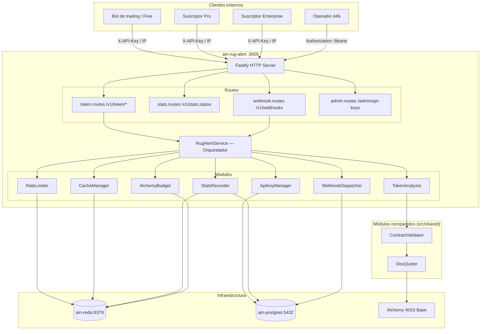
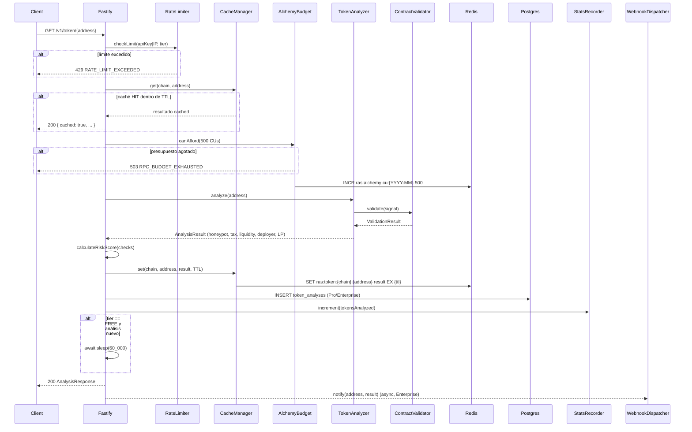
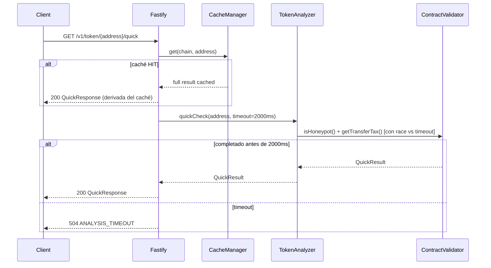

# Design Document: Rug Alert Service (RAS)

## Overview

El **Rug Alert Service (RAS)** expone el pipeline de detección de rug/honeypot del Autonomous Income Node como una API REST monetizable. Reutiliza `ContractValidator` y `DexQuoter` (ya probados con >30,000 tokens en Base mainnet) y añade las capas de negocio necesarias: autenticación por tier, caché Redis, rate limiting, historial PostgreSQL, webhooks y protección de presupuesto Alchemy.

El servicio corre como contenedor Docker independiente `ain-rug-alert` en el puerto 3005 dentro de `ain-network`, con acceso a los mismos `ain-postgres:5432` y `ain-redis:6379` que usan los demás microservicios del AIN.

### Objetivos de diseño

- **Reutilización máxima**: delegar toda la lógica on-chain a `ContractValidator`; el RAS solo orquesta.
- **Isolación de presupuesto**: el RAS nunca consume más del 10% de los CUs mensuales de Alchemy (33M de 330M totales).
- **Diferenciación de tiers**: Free recibe datos con delay de 60 s y TTL largo (300 s); Pro/Enterprise reciben datos frescos (TTL 30 s).
- **Consistencia de respuestas**: serialización JSON determinista, normalización de direcciones a minúsculas.
- **Observabilidad**: logs Winston JSON estructurados, stats públicas, health check con subsistemas.

---

## Architecture

### Diagrama de componentes



### Diagrama de flujo — Full_Analysis (camino feliz)



### Diagrama de flujo — Quick_Check



---

## Components and Interfaces

### `RugAlertService` — Orquestador principal

```typescript
// src/rug-alert/RugAlertService.ts
export interface IRugAlertService {
  /** Análisis completo de un token. Aplica caché, rate limit, delay Free. */
  analyzeToken(address: string, chain: string, clientContext: ClientContext): Promise<AnalysisResponse>;
  /** Análisis rápido (honeypot + tax, timeout 2 s). */
  quickCheck(address: string, chain: string, clientContext: ClientContext): Promise<QuickCheckResponse>;
  /** Análisis en lote (hasta 10 tokens, concurrente). */
  batchAnalyze(addresses: string[], chain: string, clientContext: ClientContext): Promise<BatchResponse>;
}

export interface ClientContext {
  tier: 'free' | 'pro' | 'enterprise';
  apiKeyId?: string;       // UUID de la clave Pro/Enterprise
  apiKeyHash?: string;     // hash SHA-256 para rate limit key
  ip: string;
  isPaidX402?: boolean;    // pago one-shot via x402 (Pro equivalent)
}
```

### `TokenAnalyzer` — Wrapper de ContractValidator

```typescript
// src/rug-alert/modules/TokenAnalyzer.ts
export interface CheckResult {
  honeypot: {
    detected: boolean;
    confidence: number;       // [0.0, 1.0]
  };
  transferTax: {
    sellTaxPct: number;       // integer %, redondeado hacia arriba
  };
  liquidity: {
    usdcEquivalent: number;   // valor en USD (6 decimales normalizado)
    locked: boolean;
  };
  deployer: {
    flagged: boolean;
    reason?: 'previous_rug' | null;
  };
}

export interface AnalysisResult {
  address: string;           // minúsculas
  chain: string;
  safe: boolean;
  riskScore: number;         // [0, 100]
  checks: CheckResult;
  analyzedAt: string;        // ISO 8601
}

export interface ITokenAnalyzer {
  analyze(address: string, chain: string): Promise<AnalysisResult>;
  quickCheck(address: string, chain: string, timeoutMs: number): Promise<QuickCheckResult>;
}

export interface QuickCheckResult {
  address: string;
  chain: string;
  honeypot: boolean;
  transferTaxPct: number;
  riskScore: number;
  latencyMs: number;
}
```

### `CacheManager` — Caché Redis con TTL por tier

```typescript
// src/rug-alert/modules/CacheManager.ts
export type CacheTier = 'free' | 'pro' | 'enterprise';

export interface ICacheManager {
  /** Obtiene resultado de caché. Retorna null si expirado o ausente. */
  get(chain: string, address: string): Promise<CachedResult | null>;
  /** Almacena resultado con TTL según tier. */
  set(chain: string, address: string, result: AnalysisResult, tier: CacheTier): Promise<void>;
  /** TTL en segundos: free → 300, pro/enterprise → 30 */
  getTtl(tier: CacheTier): number;
}

export interface CachedResult extends AnalysisResult {
  cachedAt: string;          // ISO 8601 del momento en que se almacenó
  cached: true;
}

// Clave Redis: ras:token:{chain}:{address_lowercase}
// TTL Free: 300 s | Pro/Enterprise: 30 s
```

### `RateLimiter` — Rate limiting por IP/API key

```typescript
// src/rug-alert/modules/RateLimiter.ts
export interface RateLimitResult {
  allowed: boolean;
  remaining: number;
  resetAt: string;           // ISO 8601 de la próxima medianoche UTC
}

export interface IRateLimiter {
  /** Verifica y consume 1 crédito. Clave: apiKeyHash o IP. */
  check(identifier: string, tier: 'free' | 'pro' | 'enterprise'): Promise<RateLimitResult>;
  /** Obtiene el conteo actual sin consumir. */
  getCount(identifier: string): Promise<number>;
}

// Clave Redis: ras:ratelimit:{identifier}:{YYYY-MM-DD}
// TTL de la clave: 25 horas
// Límites: free → 10/día, pro → 10,000/día, enterprise → ilimitado
```

### `ApiKeyManager` — CRUD de API keys en PostgreSQL

```typescript
// src/rug-alert/modules/ApiKeyManager.ts
export interface ApiKeyRecord {
  id: string;                // UUID
  keyHash: string;           // SHA-256 hex (64 chars)
  keyPrefix: string;         // primeros 8 chars del plaintext
  tier: 'pro' | 'enterprise';
  label?: string;
  status: 'active' | 'revoked';
  createdAt: string;         // ISO 8601
}

export interface CreateKeyResult {
  key: string;               // plaintext — solo se retorna una vez
  prefix: string;
  tier: 'pro' | 'enterprise';
  createdAt: string;
}

export interface IApiKeyManager {
  /** Valida header X-API-Key. Retorna null si inválida o revocada. */
  validateKey(rawKey: string): Promise<ApiKeyRecord | null>;
  /** Crea nueva key. Persiste hash SHA-256 en PostgreSQL. */
  createKey(tier: 'pro' | 'enterprise', label?: string): Promise<CreateKeyResult>;
  /** Marca key como revocada. */
  revokeKey(prefix: string): Promise<boolean>;
  /** Lista todas las keys con requestsToday calculado desde Redis. */
  listKeys(): Promise<ApiKeySummary[]>;
}

export interface ApiKeySummary extends ApiKeyRecord {
  requestsToday: number;
}
```

### `WebhookDispatcher` — Entregas con retry

```typescript
// src/rug-alert/modules/WebhookDispatcher.ts
export interface WebhookSubscription {
  id: string;                // UUID
  apiKeyId: string;          // UUID de la key Enterprise
  url: string;               // HTTPS URL
  addresses: string[];       // token addresses a monitorear (minúsculas)
  status: 'active' | 'failed';
  createdAt: string;
}

export interface WebhookPayload extends AnalysisResult {
  webhookId: string;
  deliveredAt: string;       // ISO 8601
}

export interface IWebhookDispatcher {
  /** Registra nueva suscripción Enterprise. */
  subscribe(apiKeyId: string, url: string, addresses: string[]): Promise<WebhookSubscription>;
  /** Desactiva suscripción (DELETE). */
  unsubscribe(subscriptionId: string, apiKeyId: string): Promise<boolean>;
  /** Notifica a todos los webhooks suscritos a la dirección. Fire-and-forget con retry. */
  notify(address: string, result: AnalysisResult): Promise<void>;
}
// Retry: 3 intentos, backoff exponencial 1s → 2s → 4s
// Fallo permanente tras 3 reintentos → status: "failed"
```

### `AlchemyBudget` — Tracking de CUs

```typescript
// src/rug-alert/modules/AlchemyBudget.ts
export interface IBudgetTracker {
  /** Verifica si hay CUs disponibles. Retorna false si >= 33M. */
  canAfford(estimatedCus: number): Promise<boolean>;
  /** Reserva CUs antes de la llamada RPC. */
  consume(cus: number): Promise<number>;   // retorna el nuevo total
  /** CUs consumidos este mes. */
  getMonthlyUsage(): Promise<number>;
}
// Clave Redis: ras:alchemy:cu:{YYYY-MM}
// Full_Analysis: 500 CUs | Quick_Check: 200 CUs | Límite: 33,000,000 CUs/mes
```

### `StatsRecorder` — Métricas en Redis

```typescript
// src/rug-alert/modules/StatsRecorder.ts
export interface ServiceStats {
  tokensAnalyzed: number;
  honeypotDetectionRate: number;   // porcentaje 0-100
  avgAnalysisMs: number;
  uptimeHours: number;
  alchemyCuUsedThisMonth: number;
}

export interface IStatsRecorder {
  /** Incrementa contador atómico de tokens analizados. */
  incrementTokensAnalyzed(): Promise<void>;
  /** Registra tiempo de análisis para media móvil. */
  recordLatency(ms: number): Promise<void>;
  /** Registra detección de honeypot (para tasa). */
  recordHoneypotDetection(detected: boolean): Promise<void>;
  /** Agrega y retorna stats actuales (desde caché Redis 60 s). */
  getStats(): Promise<ServiceStats>;
}
```

### `RugAlertConfig`

```typescript
// src/rug-alert/config/RugAlertConfig.ts
export interface RugAlertConfig {
  port: number;                    // 3005
  redisUrl: string;                // redis://ain-redis:6379
  alchemyWssUrl: string;           // wss://base-mainnet...
  // Presupuesto Alchemy
  alchemyMonthlyBudgetCus: number; // 33_000_000
  cuCostFullAnalysis: number;      // 500
  cuCostQuickCheck: number;        // 200
  // Rate limits
  rateLimitFreePerDay: number;     // 10
  rateLimitProPerDay: number;      // 10_000
  // Caché TTL
  cacheTtlFreeSeconds: number;     // 300
  cacheTtlProSeconds: number;      // 30
  // Delays
  freeAnalysisDelayMs: number;     // 60_000
  // Timeouts
  quickCheckTimeoutMs: number;     // 2_000
  // Pagos x402
  x402PriceFullUsdc: string;       // "0.01"
  x402PriceQuickUsdc: string;      // "0.005"
  // Stats caché
  statsCacheTtlSeconds: number;    // 60
}
```

### Rutas HTTP

```typescript
// src/rug-alert/routes/token.routes.ts
// GET  /v1/token/:address           → Full_Analysis
// GET  /v1/token/:address/quick     → Quick_Check
// POST /v1/tokens/batch             → Batch
// GET  /v1/token/:address/history   → Historial (Pro/Enterprise)

// src/rug-alert/routes/stats.routes.ts
// GET  /v1/stats    → ServiceStats (público)
// GET  /v1/status   → HealthCheck (público)

// src/rug-alert/routes/webhook.routes.ts
// POST   /v1/webhooks         → Subscribe (Enterprise)
// DELETE /v1/webhooks/:id     → Unsubscribe (Enterprise)

// src/rug-alert/routes/admin.routes.ts
// POST   /admin/api-keys          → CreateKey
// DELETE /admin/api-keys/:prefix  → RevokeKey
// GET    /admin/api-keys          → ListKeys
```

---

## Data Models

### Schema PostgreSQL completo

```sql
-- migrations/001_rug_alert_schema.sql

-- ── API Keys ──────────────────────────────────────────────────────────────
CREATE TABLE IF NOT EXISTS api_keys (
  id          UUID          PRIMARY KEY DEFAULT gen_random_uuid(),
  key_hash    VARCHAR(64)   NOT NULL UNIQUE,  -- SHA-256 hex del plaintext
  key_prefix  VARCHAR(8)    NOT NULL,          -- primeros 8 chars del plaintext
  tier        VARCHAR(20)   NOT NULL CHECK (tier IN ('pro', 'enterprise')),
  label       VARCHAR(200),
  status      VARCHAR(20)   NOT NULL DEFAULT 'active'
                            CHECK (status IN ('active', 'revoked')),
  created_at  TIMESTAMPTZ   NOT NULL DEFAULT NOW()
);

CREATE INDEX IF NOT EXISTS idx_api_keys_hash   ON api_keys(key_hash);
CREATE INDEX IF NOT EXISTS idx_api_keys_prefix ON api_keys(key_prefix);
CREATE INDEX IF NOT EXISTS idx_api_keys_status ON api_keys(status);

-- ── Historial de análisis (Pro/Enterprise) ────────────────────────────────
CREATE TABLE IF NOT EXISTS token_analyses (
  id           SERIAL        PRIMARY KEY,
  address      VARCHAR(42)   NOT NULL,           -- minúsculas
  chain        VARCHAR(20)   NOT NULL DEFAULT 'base',
  safe         BOOLEAN       NOT NULL,
  risk_score   INTEGER       NOT NULL CHECK (risk_score BETWEEN 0 AND 100),
  checks_json  JSONB         NOT NULL,
  analyzed_at  TIMESTAMPTZ   NOT NULL DEFAULT NOW()
);

CREATE INDEX IF NOT EXISTS idx_token_analyses_address
  ON token_analyses(address, analyzed_at DESC);
CREATE INDEX IF NOT EXISTS idx_token_analyses_chain_address
  ON token_analyses(chain, address);

-- ── Suscripciones webhook (Enterprise) ───────────────────────────────────
CREATE TABLE IF NOT EXISTS webhook_subscriptions (
  id          UUID          PRIMARY KEY DEFAULT gen_random_uuid(),
  api_key_id  UUID          REFERENCES api_keys(id) ON DELETE CASCADE,
  url         TEXT          NOT NULL,
  addresses   TEXT[]        NOT NULL,
  status      VARCHAR(20)   NOT NULL DEFAULT 'active'
                            CHECK (status IN ('active', 'failed', 'deleted')),
  created_at  TIMESTAMPTZ   NOT NULL DEFAULT NOW()
);

CREATE INDEX IF NOT EXISTS idx_webhook_subs_api_key ON webhook_subscriptions(api_key_id);
CREATE INDEX IF NOT EXISTS idx_webhook_subs_status  ON webhook_subscriptions(status);
-- Índice GIN para búsqueda eficiente por dirección en el array
CREATE INDEX IF NOT EXISTS idx_webhook_subs_addresses
  ON webhook_subscriptions USING GIN (addresses);
```

### Estructuras Redis

| Clave | Tipo | TTL | Descripción |
|---|---|---|---|
| `ras:token:{chain}:{address}` | String (JSON) | 300s (Free) / 30s (Pro) | Caché de resultado de análisis |
| `ras:ratelimit:{identifier}:{YYYY-MM-DD}` | String (counter) | 25 horas | Contador de requests diarios |
| `ras:alchemy:cu:{YYYY-MM}` | String (counter) | fin de mes + 1 día | CUs consumidos este mes |
| `ras:stats:cache` | String (JSON) | 60s | Estadísticas agregadas |
| `ras:stats:tokens_analyzed` | String (counter) | sin TTL | Total tokens únicos analizados |
| `ras:stats:latency_sum` | String (counter) | sin TTL | Suma de latencias para media |
| `ras:stats:latency_count` | String (counter) | sin TTL | Número de análisis para media |
| `ras:stats:honeypot_total` | String (counter) | sin TTL | Total análisis para tasa honeypot |
| `ras:stats:honeypot_detected` | String (counter) | sin TTL | Total honeypots detectados |

### Modelo de respuesta JSON — Full_Analysis

```typescript
// Contrato de respuesta HTTP 200 para GET /v1/token/{address}
interface FullAnalysisResponse {
  address: string;              // minúsculas, normalizado
  chain: "base";
  safe: boolean;
  riskScore: number;            // [0, 100]
  checks: {
    honeypot: {
      detected: boolean;
      confidence: number;       // [0.0, 1.0]
    };
    transferTax: {
      sellTaxPct: number;       // integer %, ceil
    };
    liquidity: {
      usdcEquivalent: number;
      locked: boolean;
    };
    deployer: {
      flagged: boolean;
      reason: "previous_rug" | null;
    };
  };
  cached: boolean;
  cachedAt: string | null;      // ISO 8601 o null si no hay caché
  analyzedAt: string;           // ISO 8601
}
```

### Cálculo del Risk Score

```
riskScore = 0
+ 40  si checks.honeypot.detected === true
+ 20  si checks.transferTax.sellTaxPct > 5
+ 15  si checks.liquidity.usdcEquivalent < 5000
+ 20  si checks.deployer.flagged === true
+ 10  si checks.liquidity.locked === false
= min(total, 100)

safe = riskScore <= 30
    && !honeypot.detected
    && transferTax.sellTaxPct <= 5
    && liquidity.usdcEquivalent >= 5000
    && !deployer.flagged
    && liquidity.locked === true
```

---

## Correctness Properties

*Una propiedad es una característica o comportamiento que debe ser verdadero en todas las ejecuciones válidas del sistema — esencialmente, una declaración formal sobre lo que el sistema debe hacer. Las propiedades sirven como puente entre especificaciones legibles por humanos y garantías de corrección verificables automáticamente.*

### Property 1: Risk Score dentro del rango [0, 100]

*Para cualquier* combinación de resultados de los 5 checks (honeypot, sellTax, liquidez, deployer, LP lock), el `riskScore` calculado SHALL estar siempre en el rango [0, 100] sin excepción, incluso cuando todas las penalidades se aplican simultáneamente (máximo teórico = 105 → truncado a 100).

**Validates: Requirements 12.1, 12.2**

---

### Property 2: Penalidades aditivas deterministas

*Para cualquier* combinación de flags booleanos de los checks `{ honeypot, highTax, lowLiquidity, badDeployer, lpUnlocked }`, la función `calculateRiskScore(checks)` SHALL producir el mismo valor entero en todas las invocaciones con el mismo input (sin aleatoriedad ni estado externo).

**Validates: Requirements 12.1, 12.2**

---

### Property 3: Safe implica riskScore ≤ 30

*Para cualquier* resultado de análisis donde `safe === true`, el campo `riskScore` SHALL ser siempre ≤ 30. Equivalentemente: si `riskScore > 30`, entonces `safe === false`.

**Validates: Requirements 12.3**

---

### Property 4: Todos los checks pasan → riskScore exactamente 0

*Para cualquier* token donde los 5 checks pasan sin penalidad (honeypot=false, sellTax≤5%, liquidez≥$5K, deployer no flaggeado, LP locked=true), el `riskScore` SHALL ser exactamente 0 y `safe` SHALL ser `true`.

**Validates: Requirements 12.4**

---

### Property 5: Idempotencia por caché — mismo riskScore

*Para cualquier* dirección de token analizada dos veces dentro del Cache_TTL, las dos respuestas SHALL contener el mismo `riskScore`, los mismos valores en `checks`, y el mismo `analyzedAt`. La segunda respuesta tendrá `cached: true` y la primera `cached: false`.

**Validates: Requirements 12.5, 5.4**

---

### Property 6: Normalización de dirección — case-insensitive

*Para cualquier* dirección de token válida enviada en cualquier combinación de mayúsculas/minúsculas (e.g., `0xAbCd...`), el campo `address` en la respuesta SHALL ser siempre la versión en minúsculas, y el análisis SHALL ser idéntico al que se retornaría si el cliente hubiese enviado la dirección en minúsculas.

**Validates: Requirements 16.2, 16.6**

---

### Property 7: Round-trip de serialización JSON

*Para cualquier* respuesta válida de Full_Analysis, serializar el objeto a JSON y luego deserializarlo SHALL producir un objeto cuya re-serialización JSON sea byte-a-byte idéntica a la cadena original (sin pérdida de precisión en enteros, sin omisión de campos con valor `0`).

**Validates: Requirements 16.3, 16.4**

---

### Property 8: Rate limiting contiene requests diarios

*Para cualquier* cliente Free_Tier identificado por un `identifier` (IP o apiKeyHash), después de exactamente 10 requests en el mismo día UTC, el request número 11 SHALL ser rechazado con HTTP 429, independientemente del intervalo entre requests.

**Validates: Requirements 4.1, 4.3**

---

### Property 9: Caché sirve respuesta aunque presupuesto CUs esté agotado

*Para cualquier* solicitud de análisis que puede ser atendida íntegramente desde el caché Redis (resultado presente y dentro del TTL), el RAS SHALL retornar el resultado en caché aunque el contador de CUs mensuales haya alcanzado o superado 33,000,000.

**Validates: Requirements 11.3**

---

### Property 10: Batch preserva orden de entrada

*Para cualquier* array de hasta 10 direcciones válidas enviado en `POST /v1/tokens/batch`, el array de resultados en la respuesta SHALL estar en el mismo orden que el array de entrada, incluso cuando los análisis se ejecutan concurrentemente.

**Validates: Requirements 3.1, 3.5**

---

## Error Handling

### Estrategia general

El RAS usa el patrón **fail-fast con respuestas estructuradas**: toda excepción interna es capturada antes de llegar a Fastify y mapeada a una respuesta HTTP con código y cuerpo JSON predefinidos.

```typescript
// Contrato de error estándar
interface ErrorResponse {
  error: string;           // código de error UPPER_SNAKE_CASE
  message?: string;        // descripción legible (opcional, no en producción)
  retryAfterMs?: number;   // para errores 503/429
  resetAt?: string;        // ISO 8601 para rate limit
  requiredUsdc?: string;   // para errores x402
  receivedUsdc?: string;
  minimum?: string;        // tier mínimo requerido
  max?: number;            // para BATCH_LIMIT_EXCEEDED
}
```

### Tabla de errores y respuestas

| Situación | HTTP | Código de error |
|---|---|---|
| Dirección inválida | 400 | `INVALID_ADDRESS` |
| Chain no soportada | 400 | `UNSUPPORTED_CHAIN` |
| Lote > 10 tokens | 400 | `BATCH_LIMIT_EXCEEDED` |
| Lote vacío | 400 | `EMPTY_BATCH` |
| API key inválida | 401 | `INVALID_API_KEY` |
| Admin sin autorización | 401 | `UNAUTHORIZED` |
| Pago x402 inválido | 402 | `PAYMENT_INVALID` |
| Pago x402 insuficiente | 402 | `PAYMENT_INSUFFICIENT` |
| Tier insuficiente | 403 | `TIER_REQUIRED` |
| Rate limit excedido | 429 | `RATE_LIMIT_EXCEEDED` |
| ContractValidator RPC error | 503 | `ANALYSIS_UNAVAILABLE` |
| Budget CUs agotado | 503 | `RPC_BUDGET_EXHAUSTED` |
| Quick_Check timeout | 504 | `ANALYSIS_TIMEOUT` |

### Resiliencia de subsistemas

**Redis no disponible:**
- CacheManager: `get()` retorna `null` (cache miss), `set()` es no-op silencioso.
- RateLimiter: falla abierta (permite el request) con log de advertencia.
- AlchemyBudget: falla abierta (permite la llamada) con log de advertencia.
- El campo `cached` se incluye como `false` y `cachedAt` como `null`.

**PostgreSQL no disponible:**
- `ApiKeyManager.validateKey()` retorna `null` → el request es tratado como Free_Tier.
- La persistencia en `token_analyses` falla silenciosamente (log warn, no 500).
- El health check reporta `"postgres": "down"` y `"status": "degraded"`.

**Alchemy RPC no disponible:**
- `ContractValidator` lanza excepción → `TokenAnalyzer` retorna error → RAS retorna 503 `ANALYSIS_UNAVAILABLE`.
- El health check reporta `"rpc": "down"` con verificación de latencia (ping via `eth_blockNumber`).

---

## Testing Strategy

### Enfoque dual

Se usa una estrategia de testing de **dos capas complementarias**:

1. **Tests unitarios con ejemplos**: verifican comportamiento específico con entradas concretas, casos límite y condiciones de error.
2. **Tests de propiedades (Property-Based Testing)**: verifican propiedades universales con entradas generadas aleatoriamente (mínimo 100 iteraciones por propiedad).

Ambas capas son necesarias: los tests unitarios capturan bugs concretos conocidos; los tests de propiedades descubren edge cases inesperados.

### Librería de PBT

Se usa **[fast-check](https://fast-check.dev/)** (TypeScript-native, ESM compatible, integración con Vitest).

```
npm install --save-dev fast-check @fast-check/vitest
```

### Organización de tests

```
src/rug-alert/tests/
├── unit/
│   ├── riskScore.test.ts        — ejemplos específicos del cálculo
│   ├── apiKeyManager.test.ts    — flujos CRUD de API keys
│   ├── rateLimiter.test.ts      — ejemplos de límites y resets
│   └── serialization.test.ts   — casos concretos de JSON
├── property/
│   ├── riskScore.property.ts    — Properties 1–4
│   ├── cache.property.ts        — Properties 5, 9
│   ├── normalization.property.ts — Properties 6, 7
│   ├── rateLimit.property.ts    — Property 8
│   └── batch.property.ts        — Property 10
└── integration/
    ├── tokenAnalyzer.integration.ts — contra Alchemy WSS real (CI opcional)
    └── health.integration.ts        — subsistemas disponibles
```

### Configuración de tests de propiedad

Cada test de propiedad debe:
- Ejecutarse mínimo **100 iteraciones** (`numRuns: 100`).
- Incluir un comentario con el tag de la propiedad que valida.
- Usar mocks para `ContractValidator` y llamadas RPC (los tests de propiedad prueban la lógica del RAS, no el comportamiento de Alchemy).

```typescript
// Ejemplo: Property 1 — riskScore en [0, 100]
// Feature: rug-alert-service, Property 1: riskScore dentro del rango [0, 100]
it.prop([
  fc.boolean(),        // honeypot
  fc.boolean(),        // highTax
  fc.boolean(),        // lowLiquidity
  fc.boolean(),        // badDeployer
  fc.boolean(),        // lpUnlocked
], { numRuns: 100 })(
  'riskScore siempre está en [0, 100]',
  (honeypot, highTax, lowLiq, badDeployer, lpUnlocked) => {
    const score = calculateRiskScore({ honeypot, highTax, lowLiq, badDeployer, lpUnlocked });
    expect(score).toBeGreaterThanOrEqual(0);
    expect(score).toBeLessThanOrEqual(100);
  }
);
```

### Tests de integración (no PBT)

Los siguientes criterios se verifican con tests de integración con 1-3 ejemplos representativos (no con PBT, ya que dependen de servicios externos o configuración):

- **10.1–10.4**: Health check — subsistemas disponibles/degradados (mock de Redis/Postgres/RPC).
- **11.1–11.2**: Presupuesto CUs — contadores Redis actualizan correctamente.
- **14.4–14.5**: Admin endpoints requieren auth y están restringidos a la red Docker.
- **8.3–8.5**: Webhook delivery con servidor HTTP mock para capturar payloads.

### Consideraciones de rendimiento

- El delay de 60 s para Free_Tier usa `setTimeout` en el proceso Node, no bloquea el event loop.
- El `quickCheck` usa `Promise.race([analysisPromise, timeoutPromise])` con cleanup del timeout al resolverse.
- Las llamadas al `ContractValidator` para análisis en lote usan `Promise.allSettled()` (concurrencia real).
- El `WebhookDispatcher.notify()` es fire-and-forget: no espera a las entregas para retornar al cliente.
- Los contadores Redis usan `INCR` atómico (no `GET` + `SET`) para evitar race conditions.

### Consideraciones de seguridad

- Las API keys se almacenan únicamente como hash SHA-256; el plaintext solo se retorna en la respuesta de creación.
- Los endpoints `/admin/*` deben estar detrás de un middleware de red Docker (`trust proxy false` o equivalente).
- El header `X-API-Key` no se loguea en texto claro; solo se loguea el prefijo de 8 caracteres.
- Las direcciones de tokens se normalizan a minúsculas antes de cualquier uso en Redis, PostgreSQL o logs.
- Los payloads de webhook incluyen solo datos del análisis; nunca contienen claves internas ni tokens de sesión.
- El `OPERATOR_API_KEY` se compara con timing-safe equal (siguiendo el patrón de `OperatorAuthenticator` existente).
