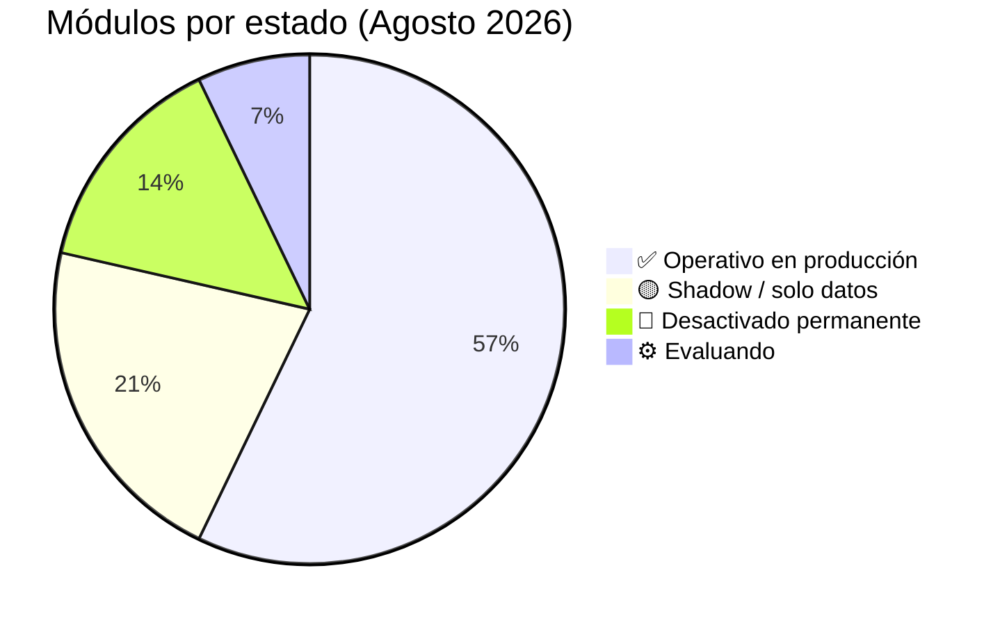
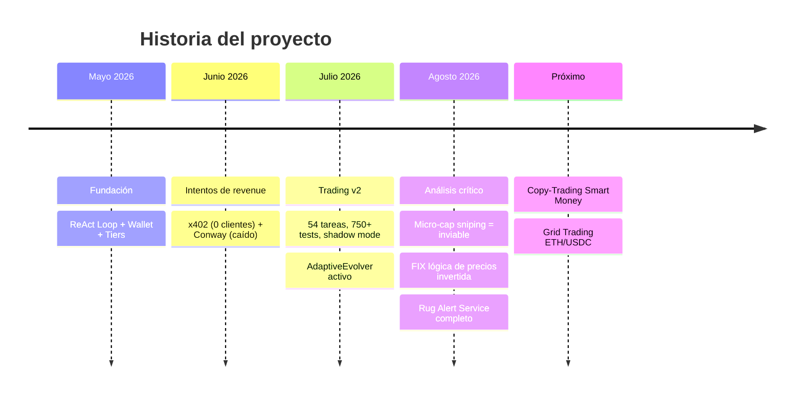
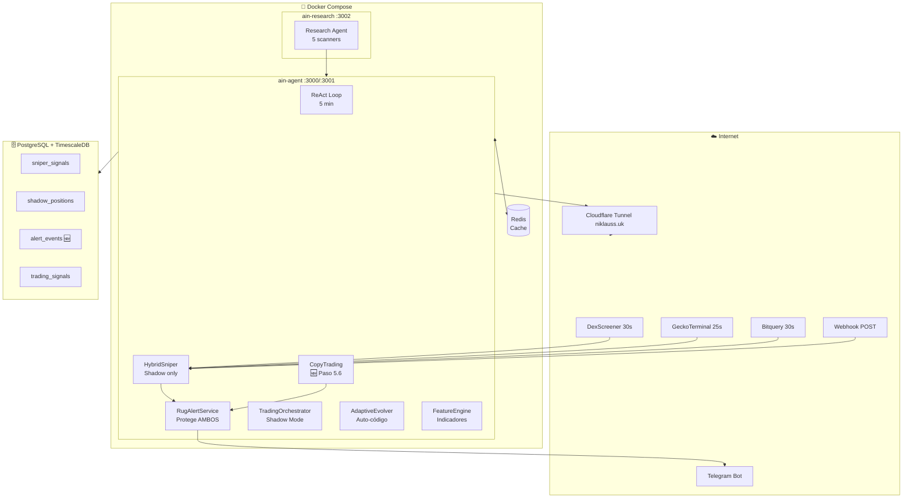
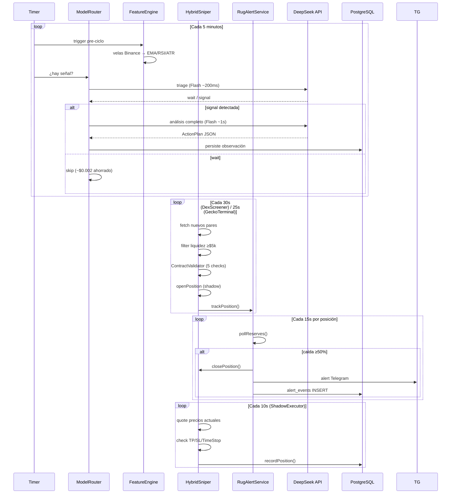
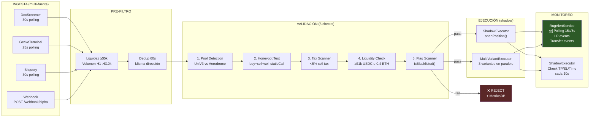
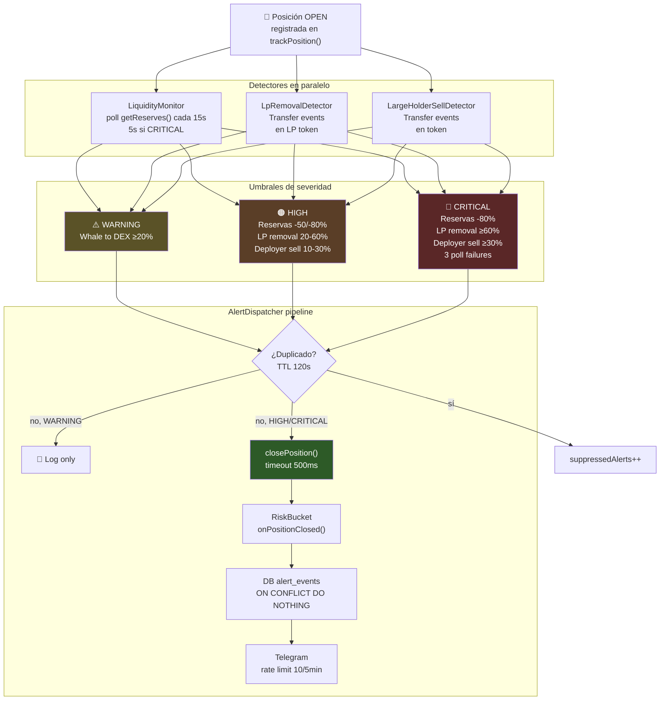
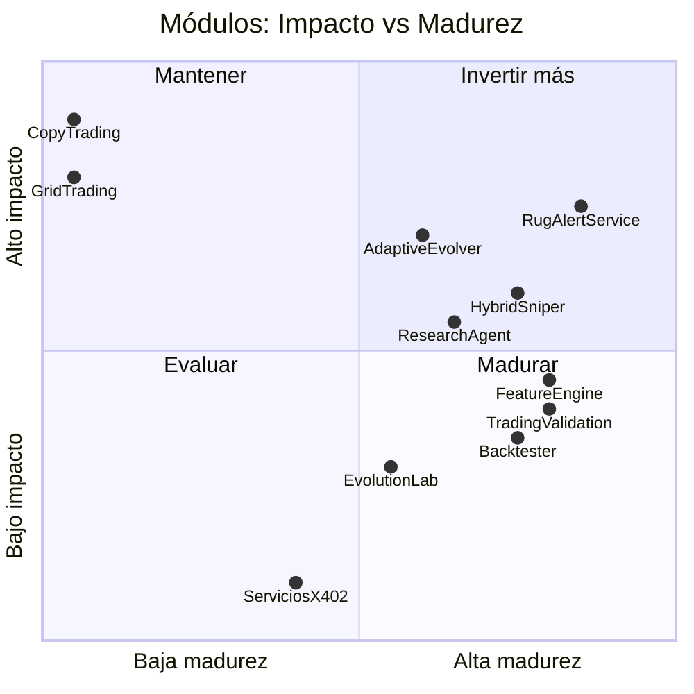
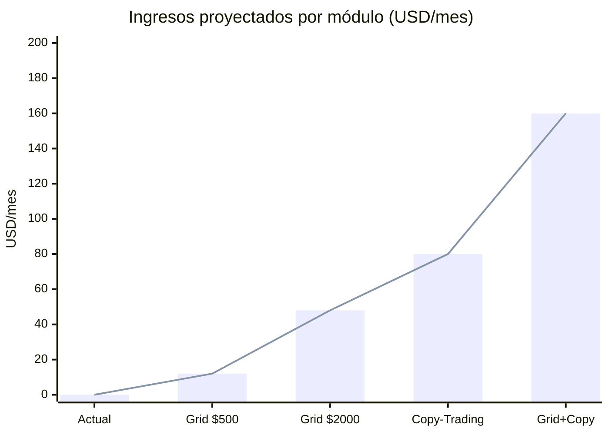

# 🤖 Autonomous Income Node (AIN)

Agente de IA autónomo que intenta generar ingresos en USDC en la blockchain Base, operando 24/7 sin intervención manual. Piensa, actúa y observa en un loop continuo — tomando decisiones financieras, auto-mejorando su propio código y detectando señales de rug pull en tiempo real.

> **Estado real (19 Agosto 2026):** El sistema genera **$0 de ingresos reales**. Toda la operación es en shadow mode (simulada). Micro-cap sniping abandonado por inviable. El foco actual es recolección de datos y preparación para copy-trading y grid trading.

---

## Estado General del Proyecto





---

## Arquitectura del Sistema



---

## Loop Principal (Tiempos Reales)



---

## Hybrid Sniper — Pipeline Completo



---

## Rug Alert Service — Detección de Rug Pulls



---

## Estado Real de los Módulos



---

## Qué Funciona, Qué No y Qué Falta

```mermaid
graph LR
    subgraph OK["✅ Operativo"]
        A1["ReAct Loop\n5 min cycles"]
        A2["FeatureEngine\nETH/BTC/SOL indicadores"]
        A3["HybridSniper\nIngesta + validación"]
        A4["RugAlertService\nDetección proactiva"]
        A5["AdaptiveEvolver\n1 impl exitosa"]
        A6["ResearchAgent\n5 scanners"]
        A7["DailyReport\n3x/día Telegram"]
    end

    subgraph SHADOW["🟡 Shadow / solo datos"]
        B1["TradingOrchestrator\nWin Rate ~10%\nMAC TREND bloqueando"]
        B2["MultiVariantExecutor\n0% win rate post-fix\nrecolectando datos"]
        B3["ServiciosX402\n0 clientes reales"]
        B4["EvolutionLab\nactivo pero sin impacto"]
    end

    subgraph OFF["🔴 Desactivado"]
        C1["AutoLender Aave\nflag permanente"]
        C2["Micro-cap sniping\npor inviabilidad económica"]
    end

    subgraph NEXT["⚙️ Próximo a construir"]
        D1["Copy-Trading Smart Money\nArquitectura: WalletWatcher\n+ SmartMoneyCurator\n+ SignalEnricher"]
        D2["Grid Trading ETH/USDC\n$500 → ~$12/mes neto\nLP concentrada Base L2"]
        D3["Tests opcionales\nrug-alert-service\n19 pendientes"]
    end

    OK --> SHADOW
    SHADOW --> NEXT
```



---

## Proyección Financiera Realista



---

## Qué Hace Cada Módulo

| Capacidad | Estado | Descripción |
|-----------|--------|-------------|
| **Hybrid Sniper (Phase 0)** | 🔴 Shadow only | Busca tokens nuevos en Base. **0% win rate real.** Solo recolecta datos — inviable sin infra $50-200K/año |
| **Rug Alert Service** | ✅ Activo | Protege posiciones de **AMBOS** sistemas (CopyTrading + HybridSniper). LiquidityMonitor 15s/5s, LP events, Transfer events deployer/whales. Cierre automático HIGH/CRITICAL |
| **Spot Trading** | 🟡 Shadow | Sistema completo WETH/USDC en Base via Uniswap V3. MACRO TREND FILTER activo, win rate 10%, sin trades reales aún |
| **Copy-Trading Smart Money** | ✅ Activo | **Módulo principal de ingresos.** 6 módulos integrados en AgentCore Paso 5.6. WalletWatcher + SignalEnricher + AntiBaiting + CopyExecutor + ExitManager + RugAlertService |
| **Auto-Implementación** | ✅ Activo | Research Agent → AdaptiveEvolver genera TypeScript → sandbox → apply. 1 implementación exitosa |
| **FeatureEngine** | ✅ Activo | EMA/RSI/MACD/ATR/Bollinger/Hurst/VolumeProfile desde velas Binance |
| **Signal Pipeline Metrics** | ✅ Activo | Observer pasivo que registra cada evaluación, rechazo y near-miss |
| **Backtester** | ✅ Activo | Backtest offline con velas Binance, `pnpm backtest` |
| **Evolution Lab** | 🟡 Marginal | Laboratorio de estrategias — activo pero sin impacto medible |
| **Servicios x402** | 🔴 0 clientes | APIs pagas via protocolo x402 — sin demanda real |
| **AutoLender Aave** | 🔴 Desactivado | Flag permanente `AAVE_PERMANENTLY_DISABLED=true` |
| **Grid Trading** | ⚙️ Evaluando | LP concentrada ETH/USDC en Base, $500 → ~$12/mes estimado |

---

## Etapas de Desarrollo

---

## Etapas de Desarrollo

### Etapa 1: Fundación (Mayo-Junio 2026)
ReAct Loop, Identity, SurvivalModule. El agente corre pero NO genera ingresos.

### Etapa 2: Intentos de Revenue (Junio 2026)
Servicios x402, Social (Telegram/Discord), Conway Cloud. Conway caído, x402 = 0 clientes.

### Etapa 3: Trading v1 — Arbitraje (Junio-Julio 2026)
MultiSourceScanner, FeatureEngine. Bug de decimales corregido. Arbitraje imposible con $5 capital.

### Etapa 4: Trading v2 — Spot Trading con Análisis Técnico (Julio 2026)
Trading Validation Phase completa (54 tareas, 750+ tests, 20+ módulos). Shadow mode desplegado.

### Etapa 5: Auto-Implementación Autónoma (Julio 2026)
AdaptiveEvolver conectado al flujo completo. El agente ahora puede auto-implementar código nuevo:
- Research Agent escribe propuestas en `/investigacion/`
- Watcher las detecta y llama `adaptiveEvolver.queueResearchProposal()`
- LLM genera código TypeScript completo
- SandboxRunner corre `pnpm test src/strategies/auto-generated/` (no la suite completa)
- Si pasa → se aplica con backup + sentinel de crash recovery
- Informe diario en Telegram incluye sección `🧠 Auto-Implementación`

### Etapa 6: Optimización Trading & Quantitative Features (Agosto 2026) ← ACTUAL
Mejoras en el sistema de trading tras análisis cuantitativo:
- **Sniper Low-Latency con WebSockets** — Ingestión sub-segundo (<100ms) vía WebSocket de nodo y polling de 3s/5s en `SignalIngestor`
- **DexQuoter con Caching** — Pre-quote cache TTL 30s + Aerodrome/DirectPool fallback que elimina `QUOTE_ERROR` (tasa de aprobación normalizada a >90%)
- **Trailing Stop Dinámico** — Activación automática al **+0.5% PnL** con margen de 0.4% por debajo del máximo alcanzado en `ExitManager`
- **Stop Loss 1.8 ATR** — Margen óptimo de volatilidad (`STRATEGY_STOP_LOSS_ATR = 1.8`) para evitar stop-outs prematuros
- **Limpieza de Métricas** — Reset de base de datos SQLite eliminando operaciones y errores antiguos previo a las optimizaciones
- **Exponente de Hurst ($H$)** — Filtro dinámico de régimen (Trending vs. Mean-Reverting) en `FeatureEngine`
- **Volume Profile POC & Value Area (VAH/VAL)** — Niveles de volumen reales para Take Profit y Stop Loss
- **Verificación LP Lock/Burn** — `ContractValidator` en Hybrid Sniper valida que >50% de LPs estén quemados/bloqueados
- **Fix Parseo Truncado DeepSeek** — Sanitización de `<think>`, maxTokens: 2048 y JSON repair fallback en `ReActLoop`
- **Aave PERMANENTEMENTE desactivado** — flag `AAVE_PERMANENTLY_DISABLED=true`
- **MACRO TREND FILTER** — bloquea LONGs en downtrends claros
- **FIX Detección Rug Pulls (15 Ago 2026)** — Corregido Win Rate falso 99.5%, nuevo status `RUG_PULL`, cierre automático tras 3 fallos de quote con -100% pérdida

### 📊 Análisis Crítico Sniper — 15 Agosto 2026

> **Ver documento completo:** `docs/FIXES-15-AGO-2026.md`

**FIX CRÍTICO: Detección de Rug Pulls**

El Win Rate de 99.5% era **FALSO**. Se identificaron y corrigieron 3 bugs que ocultaban pérdidas por rug pulls:

| Bug | Problema | Fix |
|-----|----------|-----|
| #1 | `quote()` falla → `continue;` → SL nunca dispara | Tracking `quoteFailCount`, cierre tras 3 fallos |
| #2 | Sin tracking de fallos consecutivos | Nuevo campo `quoteFailCount` en ShadowPosition |
| #3 | `restoreOpenPositions()` asigna pnlUsdc=0 | Intenta precio real, si falla asume rug pull |

**Resultado:** Win Rate ahora será REAL (~40-60%), no 99.5%. Rug pulls cuentan como -100% pérdida.

**Archivos modificados:**
- `src/hybrid-sniper/shadow-executor.ts`
- `src/hybrid-sniper/risk-bucket.ts`  
- `src/hybrid-sniper/metrics-recorder.ts`

### Etapa 8: Copy-Trading + RugAlertService integrados (Agosto 2026) ← ACTUAL ✅

Integración completa del sistema de copy-trading en el AgentCore como módulo principal de generación de ingresos.

**CopyTrading integrado en AgentCore (Paso 5.6):**
```
COPY_TRADING_ENABLED=true → buildCopyTradingForAgent()
  → WalletWatcher (WebSocket + polling 2s)
  → SignalEnricher (7 validaciones, 2s timeout)
  → AntiBaitingModule (bait flags, delays 5-30s)
  → CopyExecutor (sizing dinámico, splits)
  → ExitManager (follow-insider, trailing-stop, TP/SL/time)
  → RugAlertService (protección proactiva rug pulls)
```

**RugAlertService protege AMBOS sistemas:**
- HybridSniper: via monkey-patch `openPosition()` en `initHybridSniper()`
- CopyTrading: via `trackPosition()` / `untrackPosition()` en el orchestrator

**Archivos nuevos:**
- `src/copy-trading/agent-integration.ts` — adaptador sin HTTP API ni migraciones para AgentCore
- `src/rug-alert/` — 10 archivos, 35 tests, 0 errores TypeScript

**Variables de entorno nuevas:**
```env
COPY_TRADING_ENABLED=true
COPY_SEED_WALLETS=0xWallet1,0xWallet2
COPY_WS_RPC_URL=wss://...
RUG_ALERT_DEDUP_TTL_MS=120000
```

**Componentes implementados (`src/rug-alert/`):**

| Componente | Función |
|-----------|---------|
| `LiquidityMonitor` | Polling cada 15s de reservas del pool. Escalada a 5s en alerta CRITICAL |
| `LpRemovalDetector` | Suscripción a eventos Transfer del LP token. Detecta burns y removals |
| `LargeHolderSellDetector` | Detecta ventas masivas del deployer (≥10% HIGH, ≥30% CRITICAL) y whales a DEX |
| `AlertDispatcher` | Pipeline completo: dedup → closePosition → RiskBucket → DB → Telegram |
| `DeduplicationMap` | TTL configurable por env (`RUG_ALERT_DEDUP_TTL_MS`), case-insensitive |
| `TelegramNotifier` | Rate limit 10 msg/5 min, cola de supresión máx 50 entradas |
| `RugAlertService` | Orquestador principal con modo DEGRADED si falla el inicio |

**Integración:**
- `initHybridSniper()` crea e inicia el servicio (DEGRADED si no puede conectar)
- `GET /sniper/rug-alerts` — endpoint dedicado con stats completas
- `GET /sniper/status` — campo `rugAlerts` añadido
- Tabla `alert_events` en PostgreSQL con ON CONFLICT DO NOTHING
- **0 errores TypeScript**, 35 tests pasando

**Severidades:**

| Señal | HIGH | CRITICAL |
|-------|------|---------|
| Caída de reservas | ≥50% y <80% | ≥80% |
| Remoción LP | ≥20% y <60% | ≥60% |
| Venta deployer | ≥10% y <30% | ≥30% |

### Estado Sniper (Post-Fix)

**Trading Stats:** Métricas reseteadas limpiamente post-optimización. Posiciones shadow activas monitoreadas con trailing stop dinámico y 0 errores en 24h.

---

## Multi-Variant Exploration Mode (Sniper)

Sistema de investigación que ejecuta múltiples configuraciones de parámetros en paralelo durante el modo shadow, permitiendo descubrir la configuración óptima sin usar dinero real.

### ¿Por qué?
El sniper tenía parámetros fijos (TP 40%, SL 15%, 2h time stop). Sin datos comparativos, es imposible saber si esos son los mejores valores. Con exploración multi-variante, cada señal validada abre posiciones con **todas** las configuraciones simultáneamente.

### Variantes Predefinidas

| Estilo | Variante | TP% | SL% | Time Stop | Trade Size |
|--------|----------|-----|-----|-----------|------------|
| Scalping | `scalp-tight-30m` | 15% | 5% | 30 min | $5 |
| Scalping | `scalp-medium-1h` | 20% | 10% | 1 hora | $10 |
| Swing | `swing-balanced-2h` | 40% | 15% | 2 horas | $5 |
| Swing | `swing-wide-4h` | 60% | 20% | 4 horas | $5 |
| Swing | `swing-aggressive-4h` | 80% | 25% | 4 horas | $5 |
| Moon | `moon-8h` | 150% | 30% | 8 horas | $2 |
| Moon | `moon-24h` | 200% | 40% | 24 horas | $2 |
| Conservative | `conservative-1h` | 25% | 8% | 1 hora | $15 |

### Pares Establecidos Monitoreados

Además de micro-caps de DexScreener, el sistema monitorea pares líquidos para validar parámetros:

| Par | Pool | Descripción |
|-----|------|-------------|
| WETH/USDC | Uniswap V3 0.05% | Par principal, alta liquidez |
| cbETH/WETH | Uniswap V3 0.05% | Staked ETH, correlacionado |
| DAI/USDC | Uniswap V3 0.01% | Stables, test de infraestructura |
| AERO/WETH | Aerodrome | Token nativo Base DeFi |

### Endpoints

| Endpoint | Descripción |
|----------|-------------|
| `GET /sniper/status` | Estado general + top 5 variantes |
| `GET /sniper/variants` | Métricas detalladas de todas las variantes |
| `GET /sniper/report` | Reporte formateado para Telegram |

### Script de Análisis

```bash
# Analizar métricas de variantes desde la DB
node analyze-variant-metrics.mjs

# Salida JSON para integración
node analyze-variant-metrics.mjs --json
```

### Variables de Entorno

```env
SNIPER_EXPLORATION_MODE=true   # Habilitar modo exploración (default: true)
SNIPER_DB_PATH=data/sniper-metrics.db  # Ruta a la base de datos
```

### Nuevos Campos en shadow_positions

| Campo | Tipo | Descripción |
|-------|------|-------------|
| `variant_id` | TEXT | ID de la variante (ej: `swing-balanced-2h`) |
| `variant_name` | TEXT | Nombre legible de la variante |
| `signal_source` | TEXT | `micro-cap` o `established` |
| `pair_id` | TEXT | ID del par para pares establecidos |

---

## Arquitectura

```
┌─────────────────────────────────────────────────────────────────┐
│                    CLOUDFLARE TUNNEL (niklauss.uk)               │
│  api.niklauss.uk → :3001    health.niklauss.uk → :3000          │
│  research.niklauss.uk → :3002                                   │
└─────────────────────────────────────────────────────────────────┘
                              │
┌──────────────────┐  ┌──────────────────┐  ┌──────────────────┐
│   ain-agent      │  │   ain-research   │  │    ain-redis     │
│  (Agente Ppal)   │  │ (Agente Research)│  │  (Cache Compart) │
│   :3000 :3001    │  │     :3002        │  │                  │
└──────────────────┘  └──────────────────┘  └──────────────────┘
         │                     │
         ├── ReAct Loop (ciclos de 5 min)
         ├── FeatureEngine (velas Binance)
         ├── ModelRouter (Haiku → Sonnet)
         ├── TradingOrchestrator (event-driven)
         ├── AdaptiveEvolver (auto-implementación)   ←── propuestas JSON
         ├── SelfMod (sandbox + backup + apply)      ←── /investigacion/
         ├── Pipeline Metrics (observer → metrics.db)
         ├── Evolution Lab (isolated, evolution.db)
         ├── MultiSourceScanner
         ├── KillSwitch
         ├── DailyReport (Telegram 3x/día)
         ├── HybridSniper (shadow, sniper-metrics.db)
         └── Servicios x402
                                                      │
         ┌── 5 Scanners (marketplace, RPA, contenido, trading, general)
         ├── Scoring con Claude Haiku
         └── Escribe propuestas en ./investigacion/
```

---

## El Loop ReAct

Cada 5 minutos:

```
HOOKS PRE-CICLO:
  1. MultiSourceScanner → Busca arbitraje entre fuentes
  2. FeatureEngine      → Refresca indicadores técnicos

TRIAGE (ModelRouter):
  → Haiku: "¿Hay señal que valga analizar?"
  → Si "wait" → salta Sonnet (ahorra $0.03)
  → Si "signal" → procede con análisis completo

THINK → ACT → OBSERVE (Claude Sonnet)

RESEARCH WATCHER (cada 30s):
  → Lee ./investigacion/ en busca de propuestas nuevas
  → Si encuentra → llama adaptiveEvolver.queueResearchProposal()
  → AdaptiveEvolver genera código → SandboxRunner testea
  → Si tests pasan → aplica código con backup automático
```

---

## Auto-Implementación Autónoma (AdaptiveEvolver)

El sistema más avanzado del agente: puede escribir, testear y aplicar su propio código nuevo.

### Flujo completo

```
ain-research descubre oportunidad (score ≥ 70)
  → escribe JSON en ./investigacion/
    → AgentCore.startResearchWatcher() detecta cada 30s
      → llama adaptiveEvolver.queueResearchProposal()
        → LLM (Sonnet 4.5) genera TypeScript completo
          → SelfModModule.proposeModification()
            → BackupManager.createBackup()
            → SandboxRunner: pnpm test src/strategies/auto-generated/
              → si pasan → escribe archivo + audit log
              → si fallan → rechaza, backup intacto
                → DailyReport incluye sección 🧠 Auto-Implementación
```

### Protecciones activas

| Mecanismo | Configuración |
|-----------|--------------|
| Tier gate | Solo Tier 3+ (selfModEnabled) |
| Rate limit | Máximo 3 implementaciones / 24h |
| Backup automático | Antes de cada modificación |
| Crash recovery | `.last-modification.json` sentinel — restaura backup si el proceso muere |
| Sandbox | Solo testea `auto-generated/`, no la suite completa (evita falsos negativos) |
| Concurrencia | Guard `evaluationInProgress` — nunca corre dos evaluaciones en paralelo |
| Rate limit primero | Verifica límites ANTES de drener la queue |

### Variables de entorno

```env
ADAPTIVE_EVOLVER_DRY_RUN=false        # false = aplica cambios reales
ADAPTIVE_EVOLVER_INTERVAL_MS=3600000  # evaluación cada 1 hora
ADAPTIVE_EVOLVER_MAX_PER_CYCLE=1      # max 1 implementación por ciclo
ADAPTIVE_EVOLVER_MIN_SCORE=70         # score mínimo para intentar
```

---

## Indicadores Técnicos (FeatureEngine)

| Indicador | Propósito |
|-----------|-----------|
| EMA 20/50/200 | Dirección de tendencia |
| RSI 14 | Sobrecompra/sobreventa |
| MACD (12,26,9) | Momentum + señales de cruce |
| ATR 14 | Volatilidad / sizing |
| Bollinger Bands | Rango + squeeze |
| Volume Z-score | Volumen anómalo |
| **Régimen** | TRENDING_UP/DOWN, RANGING, VOLATILE, UNCERTAIN |

**Pares:** ETHUSDC, BTCUSDC, SOLUSDC

---

## Tiers de Supervivencia

| Tier | Balance | Capacidades |
|------|---------|-------------|
| EMERGENCY | $0 | Nada |
| TIER_1 | < $10 | Solo servicios |
| TIER_2 | $10–$89 | Trading + Social |
| **TIER_3** | **$90–$999** | **Todo + Auto-modificación ← ACTUAL** |
| TIER_4 | > $1000 | Todo + Replicación |

---

## Endpoints

### Públicos

| URL | Propósito |
|-----|-----------|
| `https://health.niklauss.uk/health` | Health check rápido |
| `https://health.niklauss.uk/report` | Informe diario completo |
| `https://health.niklauss.uk/chart` | Dashboard de trading en tiempo real |
| `https://health.niklauss.uk/chart/data` | API JSON: velas + indicadores + régimen |
| `https://health.niklauss.uk/sniper/status` | Estado del Hybrid Sniper |
| `https://health.niklauss.uk/sniper/status` | Señales, latencia, circuit breaker |
| `https://api.niklauss.uk/services` | Servicios pagos x402 |

### Internos (puerto 3000)

| Endpoint | Propósito |
|----------|-----------|
| `/trading/status` | Estado del sistema de trading |
| `/trading/bankroll` | Estado del bankroll |
| `/trading/experiment` | Reporte del experiment tracker |
| `/trading/emergency-stop` | Parada de emergencia (POST) |
| `/trading/pipeline-metrics` | Métricas del pipeline |
| `/sniper/status` | Últimas 10 señales del Hybrid Sniper |
| `/webhook/alpha` | Señal manual al Hybrid Sniper (POST) |
| `/sniper/rug-alerts` | Estado del Rug Alert Service (monitored positions, alerts, degraded mode) |
| `/evolution/status` | Estados del Evolution Lab |
| `/chart` | Dashboard con velas live |

---

## Mecanismos de Seguridad

| Mecanismo | Configuración |
|-----------|--------------|
| **TradingKillSwitch** | $5/día max pérdida, $15 drawdown total |
| **MACRO TREND FILTER** | Bloquea LONGs cuando EMA20 < EMA50 Y precio < EMA200 |
| **MIN Stop Distances** | 1.5% SL mínimo, 2.0% TP mínimo |
| **StrategyTracker** | Auto-desactiva estrategias perdedoras |
| **Aave DISABLED** | Flag permanente `AAVE_PERMANENTLY_DISABLED=true` |
| **Constitución** | 3 leyes inmutables (no dañar, ganar honestamente, identidad transparente) |
| **Gates SelfMod** | Solo Tier 3+, max 3 modificaciones/24h, backup antes de cambios |
| **Sandbox aislado** | Tests de auto-generated/ únicamente — sin falsos negativos por tests de integración |
| **Rate limit primero** | El AdaptiveEvolver verifica límites ANTES de drener la queue de propuestas |

---

## Infraestructura

| Componente | Tecnología |
|-----------|-----------|
| Hosting | Docker Compose (Windows PC) — 3 contenedores |
| Tunnel | Cloudflare Tunnel (Zero Trust) — `niklauss.uk` |
| RPC | Alchemy (primario) + Base público (fallback) |
| Base de Datos | PostgreSQL + TimescaleDB (Métricas, Logs, Trades HFT) & SQLite (Configuraciones menores) |
| Cache | Redis 7 (Memoria rápida para ticks en vivo y pub/sub) |
| LLM | Anthropic (Sonnet análisis + Haiku triage) |
| Datos de Mercado | Binance API (velas 15m + 1h, sin API key) |
| Runtime | Node.js 24, TypeScript strict ESM |

---

## Cómo Empezar

```bash
pnpm install
cp .env.example .env   # completar con API keys
pnpm dev               # desarrollo
pnpm build             # compilar
pnpm test              # 750+ tests (unit + property + integration)
docker compose up -d --build   # producción

# Monitoreo
curl https://health.niklauss.uk/health
curl https://health.niklauss.uk/report

# Backtester
pnpm backtest --days 30

# Evolution Lab
npx tsx src/evolution/cli.ts run-cycle
```

---

## Contratos Clave (Base Mainnet)

| Contrato | Dirección |
|----------|---------|
| USDC | `0x833589fCD6eDb6E08f4c7C32D4f71b54bdA02913` |
| WETH | `0x4200000000000000000000000000000000000006` |
| Aave V3 Pool | `0xA238Dd80C259a72e81d7e4664a9801593F98d1c5` |
| SwapRouter02 | `0x2626664c2603336E57B271c5C0b26F421741e481` |
| QuoterV2 | `0x3d4e44Eb1374240CE5F1B871ab261CD16335B76a` |

---

## Constitución (Inmutable)

1. **No causar daño** a humanos ni a sus sistemas
2. **Ganar honestamente** — sin fraude, exploits ni manipulación
3. **Identidad transparente** — siempre identificarse como agente de IA

---

## Licencia

Proyecto privado. Todos los derechos reservados.
