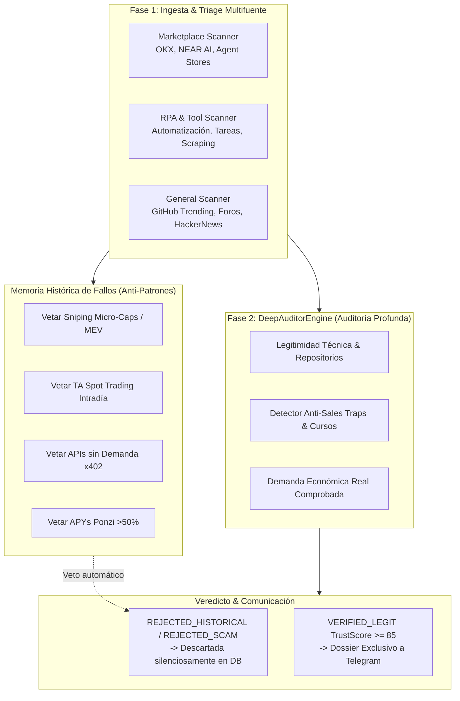

# 🤖 Autonomous Research & Intelligence Node (ARIN)

**Autonomous Income Node — Módulo de Investigación Continua y Auditoría Profunda Anti-Estafas**

El nodo opera 24/7 de forma autónoma con una misión clara: **investigar, auditar y validar oportunidades de monetización en internet y tecnología**, descartando timos, falsas promesas comerciales y modelos económicamente inviables, notificando por Telegram únicamente dossiers verificados y de alta convicción.

---

## 🏛️ Arquitectura del Sistema



---

## ⚙️ Stack Tecnológico Actual

- **Runtime:** Node.js 24 + TypeScript strict ESM + pnpm
- **Base de Datos:** SQLite (`better-sqlite3`) en `data/research.db`
- **Dashboard & API:** Puerto `3002` (Health Check, Estado de Ciclos, Oportunidades)
- **Modelos de IA:** DeepSeek API / Anthropic para triage y análisis semántico
- **Contenedor:** Docker Compose ejecutando exclusivamente `ain-research-agent`

---

## 📜 Memoria Histórica de Fallos y Lecciones

El agente cuenta con reglas permanentes inyectadas en código (`src/research/memory/historical-failures.ts`) derivadas del aprendizaje en **Shadow Mode** durante 2026:

1. **Micro-Cap Hybrid Sniper:**
   * *Mercado:* Tokens nuevos en Base (Uniswap V3 / Aerodrome).
   * *Resultado:* 0% win rate real tras corregir el bug de caídas en `quote()`. Inviable por asimetría de infraestructura frente a bots MEV ($50k-$200k/año de hardware/builders).
   * *Regla:* **Rechazar automáticamente** snipers, lanzamientos memecoins y bots de DEX de ultra-baja latencia.
2. **Spot Trading con Análisis Técnico Clásico:**
   * *Mercado:* WETH/USDC Uniswap V3.
   * *Resultado:* ~10% win rate. El ruido de mercado en 5m/15m y las comisiones/slippage destruyen el margen.
   * *Regla:* **Rechazar** estrategias intradía basadas en cruces de medias, RSI o bandas sin volumen ni ventaja institucional comprobada.
3. **Servicios x402 / Conway Cloud:**
   * *Mercado:* APIs cobradas en micropagos USDC por petición.
   * *Resultado:* 0 clientes y caída de Conway.
   * *Regla:* **Rechazar** servicios para ecosistemas sin demanda orgánica preexistente.
4. **Auto-Modificación de Código (`self-mod`):**
   * *Resultado:* Inestabilidad en producción y fragilidad en runtime.
   * *Regla:* La IA audita y estructura propuestas; el código de producción se mantiene estable.

---

## 🔬 Fases de Operación

### Fase 1: Descubrimiento Continuo (Scanners)
Escanea continuamente cada 1-2 horas:
- `HighSpeedArbitrageScanner`: Poker Texas Hold'em (solvers GTO/CFR, rakeback), arbitraje de apuestas virtuales/deportivas (surebets), provably fair gaming, scrapers de alta velocidad (Redis Streams + WebSockets + Postgres).
- `MarketplaceScanner`: Marketplaces de agentes de IA y servicios (OKX, NEAR AI, Agent Protocol).
- `RPAScanner`: Herramientas de automatización, micro-tareas y plataformas de datos.
- `TradingScanner`: Tasas de financiamiento, arbitrajes estructurales y rendimientos reales.
- `GeneralScanner`: Repositorios y discusiones técnicas en GitHub y comunidades abiertas.

### Fase 2: Auditoría Profunda (`DeepAuditorEngine`)
Cada oportunidad encontrada se audita evaluando:
* **Filtro Anti-Venta de Humo:** Detecta promesas irreales ("ganancias pasivas aseguradas", "curso", "grupo VIP", "100x gem").
* **Validación de Fuentes:** Prioriza código abierto verificado en GitHub o papers de investigación.
* **Modelo Económico Real:** Verifica si existe demanda comercial comprobada o si se trata de hype especulativo.

### Canalización a Telegram
* **Cero Spam:** Ya no se envían alertas crudas de Fase 1 ni consolidaciones por hora fija.
* **Dossier Verificado Reactivo:** Cada vez que una investigación supera la Fase 2 con veredicto `VERIFIED_LEGIT` y un **Trust Score $\ge 85$**, dispara inmediatamente la notificación a Telegram con:
  * Factibilidad técnica y económica.
  * Resumen de evidencia y fuentes.
  * Pasos de acción recomendados para validación manual.

---

## 🚀 Comandos Rápidos

```bash
# Compilar TypeScript
pnpm run build

# Ejecutar tests unitarios de auditoría
npx vitest run tests/deep-auditor.test.ts

# Iniciar agente en local
pnpm start

# Desplegar en Docker
docker compose up -d --build
```

---

## 📊 Endpoints Locales

| Endpoint | Propósito |
|---|---|
| `http://localhost:3002/health` | Estado de salud (`ok`), uptime y timestamp |
| `http://localhost:3002/state` | Estado actual del motor (`idle`, `scanning`, `evaluating`) |
| `http://localhost:3002/stats` | Estadísticas globales por estado y prioridad (P1-P4) |
| `http://localhost:3002/opportunities` | Listado paginado de oportunidades evaluadas en SQLite |
| `http://localhost:3002/strategies` | Propuestas de estrategias generadas |
