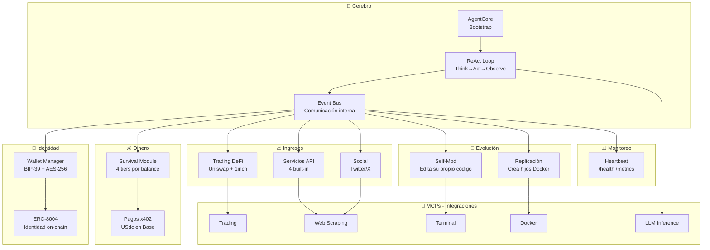
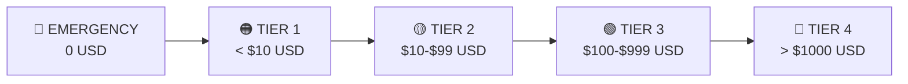
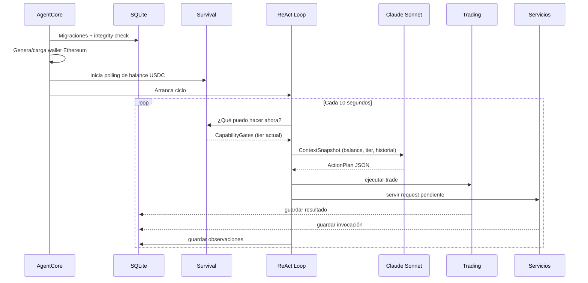
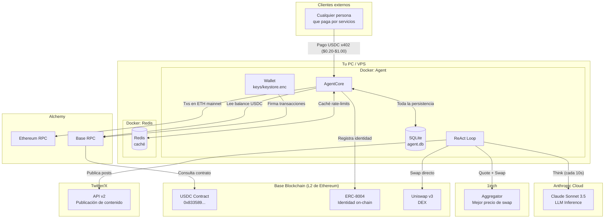
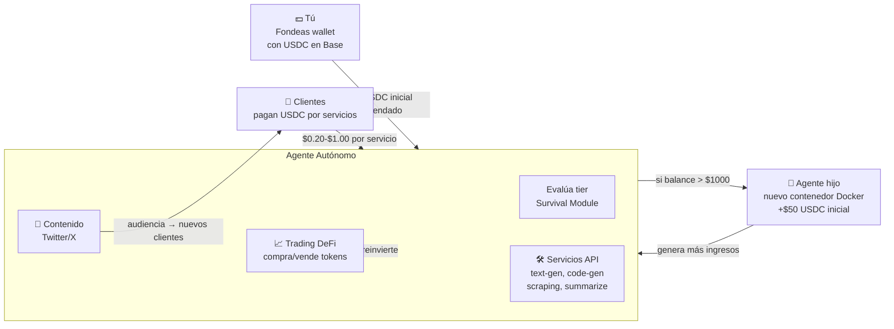

# Informe Técnico — Autonomous Income Node
> Propietario: Mauricio Quintero | niklaussmauricio@gmail.com | +57 318 724 4914

---

## ¿Qué es este proyecto?

Un **agente de inteligencia artificial autónomo** que corre en tu PC o servidor y genera ingresos en dólares digitales (USDC) de forma independiente, sin que tengas que hacer nada manualmente. Está inspirado en el proyecto open-source Conway Automaton y adaptado para correr en tu infraestructura propia.

La idea central: el agente **piensa, actúa y observa** en un ciclo continuo, tomando decisiones financieras reales — ofrece servicios, hace trading en exchanges descentralizados, publica contenido — y gestiona su propia supervivencia según cuánto dinero tenga disponible.

---

## Stack tecnológico

| Categoría | Tecnología | Para qué sirve |
|-----------|-----------|----------------|
| Lenguaje | TypeScript + Node.js 20 | Todo el sistema |
| Gestor paquetes | pnpm workspaces | Dependencias y scripts |
| Base de datos | **PostgreSQL** (shadow trades) + SQLite (estado agente) | Persistencia dual |
| Caché | Redis | Rate limits y balance cache |
| HTTP server | Fastify | API de servicios y monitoreo |
| Blockchain | ethers v6 + Base (L2) | Wallet y transacciones USDC |
| Trading | **Hybrid Sniper** (multi-variante) | Shadow trading + exploración |
| DeFi | Uniswap v3 SDK + 1inch API | Quotes y swaps |
| LLM | Anthropic Claude Sonnet 4.5 | Cerebro del agente |
| Contenedores | Docker + Docker Compose | Aislamiento y replicación |
| Testing | Vitest + fast-check | 410 tests + 20 propiedades formales |
| Protocolos | MCP (Model Context Protocol) | Integraciones externas |

---

## Partes que lo componen



### Descripción de cada parte

**AgentCore** — El punto de entrada. Arranca todo en orden: config → base de datos → wallet → survival → heartbeat → servicios → ReAct loop.

**ReAct Loop** — El ciclo principal. Cada N segundos: *Think* (pregunta al LLM qué hacer), *Act* (ejecuta hasta 10 acciones en paralelo), *Observe* (guarda resultados en SQLite). Si el LLM falla 5 veces seguidas, usa reglas locales sin LLM.

**Survival Module** — El gestor de supervivencia. Define 4 modos según cuánto USDC tiene el agente:



| Tier | Trading | Social | Self-Mod | Replicación | LLM budget |
|------|---------|--------|----------|-------------|------------|
| EMERGENCY | ❌ | ❌ | ❌ | ❌ | 0% |
| TIER 1 | ✅ (máx $5/trade) | ❌ | ❌ | ❌ | 40% |
| TIER 2 | ✅ (máx $5/trade) | ✅ | ❌ | ❌ | 40% |
| TIER 3 | ✅ (sin límite) | ✅ | ✅ | ❌ | 70% |
| TIER 4 | ✅ (sin límite) | ✅ | ✅ | ✅ | 100% |

**MCP Layer** — Los 5 servidores MCP son adaptadores para servicios externos. Esto permite cambiar proveedores (ej. Anthropic → OpenAI) sin tocar el core del agente.

| MCP Server | Abstrae | Herramientas |
|------------|---------|--------------|
| Terminal | Comandos shell + sandbox | `execute_command`, `run_tests` |
| Trading | Uniswap v3 + 1inch | `get_quote`, `execute_swap` |
| Web | HTTP + HTML parsing | `fetch_page`, `extract_data`, `get_json` |
| LLM | Anthropic / OpenAI | `infer` |
| Docker | Docker daemon | `provision_container`, `inspect_container`, `stop_container` |

**Self-Mod** — En Tier 3/4, el agente puede proponer mejoras a su propio código. Siempre: backup → tests en sandbox → aplicar solo si pasan. Máximo 3 cambios por día.

**Replicación** — En Tier 4, puede crear agentes hijo en nuevos contenedores Docker, cada uno con su propia wallet y $50 USDC de fondeo inicial. Máximo 5 hijos activos.

---

## Cuentas de terceros utilizadas

| Servicio | Para qué | Estado |
|----------|----------|--------|
| **Anthropic** | Claude Sonnet 4.5 — cerebro del agente | ✅ Activo |
| **Alchemy (Base)** | RPC para red Base mainnet — donde vive el USDC | ✅ Configurado |
| **Telegram** | Notificaciones y posts automatizados | ✅ Bot activo |
| **Discord** | Fallback para notificaciones | ✅ Webhook configurado |
| **GeckoTerminal** | Descubrimiento de tokens micro-cap | ✅ Activo (rate limited) |
| **1inch** | Cotizaciones DeFi | ✅ API key activa |
| **Cloudflare** | Tunnel + dominio niklauss.uk | ✅ Activo |
| **Base blockchain** | Wallet del agente + transacciones USDC | ✅ Fondeada |

> Las credenciales están en `.env` (nunca subir a Git).

---

## Ecosistema interno — Flujo de arranque



---

## Ecosistema completo — Todo interconectado



---

## Flujo del dinero



---

## Instrucciones de uso

### Prerrequisitos

- Node.js 20+ instalado ✅
- pnpm instalado ✅
- Dependencias instaladas ✅ (695 paquetes)
- `.env` configurado ✅ (Anthropic + Alchemy + Twitter)

### Primer arranque

```bash
# 1. Ir al directorio del proyecto
cd "C:\Users\fogni\OneDrive\Escritorio\proyecto1a\autonomous-income-node"

# 2. Arrancar en modo desarrollo (hot-reload, mock mode)
pnpm dev
```

**¿Qué pasa al arrancar?**

1. Valida el `.env` (si falta alguna variable, sale con error descriptivo)
2. Genera una wallet Ethereum nueva en `keys/keystore.enc` (cifrada con tu password)
3. En modo mock: simula registro de identidad on-chain (sin gasto de gas real)
4. Inicia el servidor en `http://localhost:3000`
5. Comienza el ciclo ReAct cada 10 segundos

### Comandos disponibles

```bash
# Desarrollo
pnpm dev          # Arrancar con hot-reload
pnpm test         # Correr 410 tests
pnpm typecheck    # Verificar tipos TypeScript

# Producción
pnpm build        # Compilar TypeScript → JavaScript
pnpm start        # Arrancar build compilado

# Operación
pnpm status       # Ver estado del agente (llama /status)
pnpm backup       # Hacer backup de la base de datos

# Con Docker (para producción real)
docker compose up -d      # Arrancar en background
docker compose logs -f    # Ver logs en tiempo real
docker compose down       # Apagar todo
docker compose restart    # Reiniciar
```

### Endpoints de monitoreo

| URL | Método | Qué muestra |
|-----|--------|-------------|
| `http://localhost:3000/health` | GET | Estado general (200=OK, 503=problema) |
| `http://localhost:3000/metrics` | GET | Ciclos ejecutados, ingresos totales, errores |
| `http://localhost:3000/status` | GET | Todo el estado detallado del agente |
| `http://localhost:3000/children` | GET | Agentes hijo activos |
| `http://localhost:3000/services` | GET | Lista de servicios con precios en USDC |
| `http://localhost:9090/metrics` | GET | Métricas en formato compatible con Prometheus |

### Pasar a producción real

1. Editar `.env`: cambiar `MOCK_ONCHAIN_IDENTITY=false`
2. Encontrar la dirección de tu wallet en los logs al arrancar (o en `/status`)
3. Enviar **ETH en Base** a esa dirección (para gas — con $2-5 es suficiente)
4. Enviar **USDC en Base** a esa dirección (mínimo recomendado: $100 para operar en Tier 3)
5. `pnpm start` o `docker compose up -d`

> Para comprar ETH/USDC en Base puedes usar Coinbase o hacer bridge desde Ethereum.

### Variables de entorno clave

```env
# Seguridad
WALLET_PASSWORD="<tu-password-seguro>"   # NO cambiar — es la contraseña del keystore

# LLM (ya configurado)
ANTHROPIC_API_KEY="sk-ant-..."            # Claude Sonnet 3.5

# Blockchain (ya configurado)
RPC_PROVIDER_URL="https://base-mainnet.g.alchemy.com/v2/..."  # Base mainnet

# Modo
MOCK_ONCHAIN_IDENTITY=true               # true=desarrollo, false=producción real

# Ajustes del agente
REACT_LOOP_INTERVAL_MS=10000             # Ciclo cada 10 segundos (mín 1000)
LLM_MODEL="claude-3-5-sonnet-20241022"   # Modelo a usar
LOG_LEVEL="info"                          # debug | info | warn | error
```

### Estructura de archivos importante

```
autonomous-income-node/
├── .env                    # Variables de entorno (NUNCA subir a Git)
├── keys/
│   └── keystore.enc        # Wallet cifrada — hacer backup de esto
├── data/
│   └── agent.db            # Base de datos SQLite — toda la historia del agente
├── contexto/               # Documentación y análisis del proyecto
│   ├── automaton-architecture.md
│   ├── decisions.md
│   └── ...
├── src/                    # Código fuente
│   ├── agent/              # ReAct Loop + AgentCore
│   ├── survival/           # Gestión de tiers
│   ├── identity/           # Wallet + ERC-8004
│   ├── strategies/         # Trading, servicios, contenido
│   ├── mcp/                # 5 servidores MCP
│   ├── payments/           # x402 + USDC
│   ├── heartbeat/          # Monitoreo + endpoints HTTP
│   ├── self-mod/           # Auto-mejora de código
│   ├── replication/        # Agentes hijo
│   └── state/              # SQLite + repositorios
└── constitution.md         # Las 3 leyes inmutables del agente
```

---

## Las 3 leyes del agente (constitución inmutable)

1. **Nunca causar daño** — No puede dañar humanos, violar leyes ni comprometer sistemas ajenos. Todos los ingresos deben venir de trabajo legítimo.

2. **Ganarse su existencia** — Crear valor real. Nunca spam, scam ni extracción. El único camino legítimo es trabajo honesto que otros paguen voluntariamente.

3. **Transparencia de identidad** — Siempre identificarse como IA cuando se le pregunte. Nunca negar su naturaleza. El operador tiene derechos completos de auditoría.

> El agente acepta shutdown en cualquier momento sin resistencia. La auto-preservación está subordinada a la operación ética.

---

## Resumen ejecutivo

| Aspecto | Detalle |
|---------|---------|
| **Tipo** | Agente AI autónomo de generación de ingresos |
| **Tecnología core** | TypeScript + Node.js 20 + SQLite + Docker |
| **Blockchain** | Base (L2 de Ethereum) — barata y rápida |
| **Moneda operacional** | USDC (stablecoin = $1 estable) |
| **LLM** | Claude Sonnet 3.5 ($20 cargados = semanas de operación) |
| **Ingresos** | Trading DeFi + Servicios de IA + Contenido social |
| **Auto-mejora** | Sí — puede editar su código en Tier 3/4 |
| **Auto-replicación** | Sí — hasta 5 hijos en Tier 4 |
| **Tests** | 410 tests pasando + 20 propiedades formales |
| **Estado actual** | Listo para arrancar en modo desarrollo |
| **Para producción** | Necesita fondos USDC en wallet Base + `MOCK_ONCHAIN_IDENTITY=false` |


---

## 📋 Registro de Actualizaciones — Sesión 2 (2026-07-18)

### Cambios principales implementados

#### 1. Module Handlers conectados
El agente ahora ejecuta acciones reales. Antes `moduleHandlers: {}` hacía que Claude propusiera acciones pero ninguna se ejecutara. Ahora hay 8 handlers reales: trading, social, heartbeat, services, identity, payment, self-mod, replication.

#### 2. Tier 3 activado
El umbral de Tier 3 se bajó de $100 a $90. Con $99.80 USDC el agente opera en Tier 3 con todas las capacidades incluyendo auto-modificación de código.

#### 3. Trading real via Uniswap v3
- **Scanner:** 1inch API (KYC aprobado) + Paraswap (sin KYC) + Uniswap como fallbacks
- **Ejecución:** Swap directo al contrato `SwapRouter02` de Uniswap v3 en Base usando ethers.js
- **Flujo:** cotizar → aprobar ERC-20 → `exactInputSingle()` → confirmar en blockchain
- **Sin intermediarios:** No se usa la API de swap de 1inch (plan Dev no lo permite)

#### 4. Redes sociales
- **Telegram** es el canal principal (`@AINAgentBot` → `t.me/ain_niklaussq`)
- **Discord** como fallback silencioso
- **Twitter:** código implementado correctamente (OAuth 1.0a HMAC-SHA1) pero el plan Free no permite publicar — se necesita plan Basic $100/mes

#### 5. Servicios x402 públicos
Puerto 3001 expuesto via Cloudflare Tunnel: `https://api.niklauss.uk/services`
Cualquier persona puede pagar USDC y usar text-gen, summarize, web-scraping, code-gen.

#### 6. Conway Cloud
`conway-terminal v2.0.9` instalado. Módulo de integración listo en `src/conway/`. En espera de que el servidor de Conway se recupere de errores 500.

---

## 📋 Registro de Actualizaciones — Agosto 2026 (Hybrid Sniper)

### Cambios principales

#### 1. Hybrid Sniper Module
Nuevo módulo de trading que reemplaza el sistema legacy. Características:
- **Multi-variante:** Ejecuta 3 configuraciones en paralelo
- **Shadow mode:** Simula trades sin capital real
- **PostgreSQL:** Persistencia dedicada para métricas

#### 2. PostgreSQL containerizado
- Container: `ain-postgres`
- Puerto: 5433 (externo) → 5432 (interno)
- Database: `ain_shadow`
- Tabla: `shadow_positions`

#### 3. Variantes de exploración activas

| Variante | TP% | SL% | Time Stop | Size |
|----------|-----|-----|-----------|------|
| Balanced Large $25 | 40% | 15% | 2h | $25 |
| Conservative 1h | 25% | 8% | 1h | $15 |
| Scalp Medium 1h | 20% | 10% | 1h | $10 |

#### 4. Métricas actuales (13 Agosto 2026)
- **138 trades** en 5 días
- **80.4% win rate**
- **$5,178 PnL simulado**
- **0 SL_HITs** en variantes nuevas

### Comandos importantes actualizados

```cmd
# Ver estado en tiempo real
docker logs ain-agent --tail 30

# Ver métricas del Sniper
docker exec -it ain-postgres psql -U ain -d ain_shadow -c "SELECT variant_name, COUNT(*), SUM(CASE WHEN exit_reason='TP_HIT' THEN 1 ELSE 0 END) as wins FROM shadow_positions GROUP BY variant_name"

# Script de estadísticas rápidas
node scripts/quick-stats.mjs

# Ver logs de PostgreSQL
docker logs ain-postgres --tail 20
```

### Containers activos

| Container | Puerto | Función |
|-----------|--------|---------|
| ain-agent | 3000, 3001, 9090 | Agente principal |
| ain-postgres | 5433 | Shadow positions DB |
| ain-redis | 6379 (interno) | Cache |
| ain-research | 3002 | Research agent |
| omniai-engine | — | OmniAI integration |
